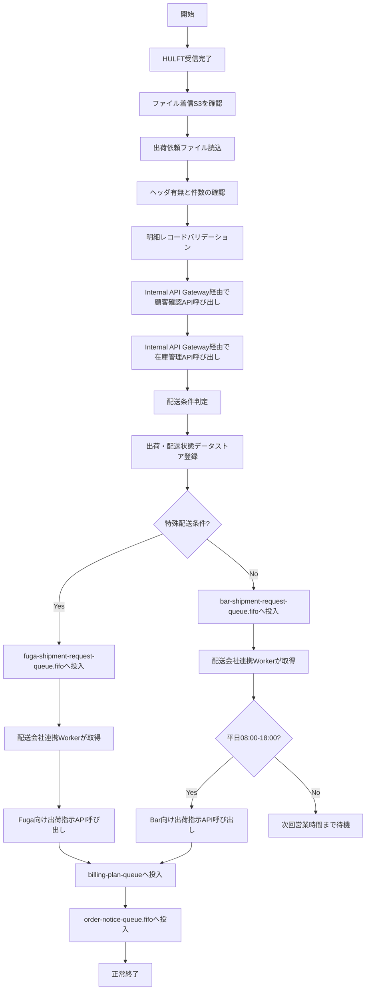
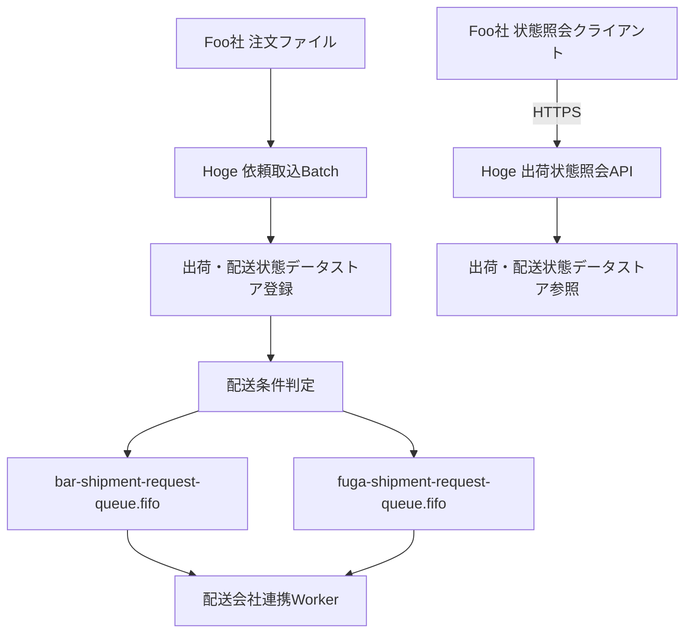

# 02. システム間連携図

## 1. 文書目的

本書は、「会社間・システム間連携を理解するための構成図」である。  
アプリ内部の詳細構成ではなく、会社間通信、システム間連携、境界、非同期基盤、ファイル連携、API連携の責任範囲が分かることを重視する。

## 2. システム間連携図

```mermaid
%%{init: {'theme': 'neutral', 'flowchart': {'curve': 'stepBefore', 'nodeSpacing': 15, 'rankSpacing': 35}}}%%
flowchart LR
    subgraph FOO_NET["Foo社閉域ネットワーク"]
        subgraph foo_g1[" "]
            QUUX@{img: "https://api.iconify.design/material-symbols/badge.svg", label: "認証連携基盤", pos: "b", w: 54, h: 54, constraint: "on"}
        end
        subgraph foo_g2[" "]
            FOO_SYS@{img: "https://api.iconify.design/material-symbols/domain.svg", label: "出荷依頼中継", pos: "b", w: 54, h: 54, constraint: "on"}
            FOO_HULFT@{img: "https://api.iconify.design/material-symbols/folder-data.svg", label: "HULFT集配信", pos: "b", w: 54, h: 54, constraint: "on"}
            FOO_STATUS_CLIENT@{img: "https://api.iconify.design/material-symbols/dns.svg", label: "状態照会クライアント", pos: "b", w: 54, h: 54, constraint: "on"}
            FOO_EDGE@{img: "https://api.iconify.design/material-symbols/security.svg", label: "Foo社対外接続境界", pos: "b", w: 54, h: 54, constraint: "on"}
        end
    end

    subgraph aws["Hoge社AWS (ap-northeast-1)"]
        subgraph vpc_hoge["連携・業務VPC"]
            subgraph hoge_g1[" "]
                H_FOO_EDGE@{img: "https://api.iconify.design/material-symbols/security.svg", label: "Foo向け接続境界", pos: "b", w: 54, h: 54, constraint: "on"}
                H_HULFT_RX@{img: "https://api.iconify.design/logos/aws-ec2.svg", label: "HULFT受信サーバ", pos: "b", w: 54, h: 54, constraint: "on"}
                H_BAR_EDGE@{img: "https://api.iconify.design/material-symbols/security.svg", label: "Bar向け接続境界", pos: "b", w: 54, h: 54, constraint: "on"}
                H_FUGA_EDGE@{img: "https://api.iconify.design/material-symbols/security.svg", label: "Fuga向け接続境界", pos: "b", w: 54, h: 54, constraint: "on"}
            end
            subgraph hoge_g2[" "]
                H_FILE_IN@{img: "https://api.iconify.design/logos/aws-s3.svg", label: "ファイル着信S3", pos: "b", w: 54, h: 54, constraint: "on"}
                H_BATCH@{img: "https://api.iconify.design/logos/aws-ecs.svg", label: "出荷・配送管理ハブ<br/>依頼取込Batch", pos: "b", w: 54, h: 54, constraint: "on"}
                H_API_GATE@{img: "https://api.iconify.design/logos/aws-elb.svg", label: "Internal API Gateway", pos: "b", w: 54, h: 54, constraint: "on"}
                H_ROUTE@{img: "https://api.iconify.design/material-symbols/alt-route.svg", label: "配送条件判定", pos: "b", w: 54, h: 54, constraint: "on"}
                H_BAR_REQ_Q["SQS<br/>bar-shipment-request-queue.fifo"]
                H_FUGA_REQ_Q["SQS<br/>fuga-shipment-request-queue.fifo"]
                H_WORKER@{img: "https://api.iconify.design/logos/aws-ecs.svg", label: "出荷・配送管理ハブ<br/>配送会社連携Worker", pos: "b", w: 54, h: 54, constraint: "on"}
                H_RESULT_IN@{img: "https://api.iconify.design/logos/aws-ecs.svg", label: "配送状態取込Worker", pos: "b", w: 54, h: 54, constraint: "on"}
                H_NOTIFY@{img: "https://api.iconify.design/logos/aws-ecs.svg", label: "配送結果返却Worker", pos: "b", w: 54, h: 54, constraint: "on"}
                H_STATUS_OUT@{img: "https://api.iconify.design/logos/aws-s3.svg", label: "配送結果返却<br/>ファイル出力S3", pos: "b", w: 54, h: 54, constraint: "on"}
                H_HULFT_TX@{img: "https://api.iconify.design/logos/aws-ec2.svg", label: "HULFT送信サーバ", pos: "b", w: 54, h: 54, constraint: "on"}
                H_STATUS_API@{img: "https://api.iconify.design/material-symbols/api.svg", label: "配送連携API<br/>直受注登録 / 出荷状態照会API", pos: "b", w: 54, h: 54, constraint: "on"}
            end
            subgraph hoge_g3[" "]
                H_FILE_DONE@{img: "https://api.iconify.design/logos/aws-s3.svg", label: "処理済みS3", pos: "b", w: 54, h: 54, constraint: "on"}
                H_STORE@{img: "https://api.iconify.design/logos/aws-rds.svg", label: "出荷・配送状態<br/>データストア", pos: "b", w: 54, h: 54, constraint: "on"}
                H_CUST@{img: "https://api.iconify.design/logos/aws-ecs.svg", label: "顧客マスタ管理", pos: "b", w: 54, h: 54, constraint: "on"}
                H_STOCK@{img: "https://api.iconify.design/logos/aws-ecs.svg", label: "在庫管理", pos: "b", w: 54, h: 54, constraint: "on"}
                H_BILL_Q["SQS<br/>billing-plan-queue"]
                H_ORDER_Q["SQS<br/>order-notice-queue.fifo"]
                H_ARCH_BATCH@{img: "https://api.iconify.design/logos/aws-ecs.svg", label: "日次アーカイブBatch", pos: "b", w: 54, h: 54, constraint: "on"}
                H_ARCH_OUT@{img: "https://api.iconify.design/logos/aws-s3.svg", label: "アーカイブ出力S3", pos: "b", w: 54, h: 54, constraint: "on"}
                H_ARCHIVE@{img: "https://api.iconify.design/logos/aws-s3.svg", label: "売上アーカイブS3", pos: "b", w: 54, h: 54, constraint: "on"}
            end
        end
    end

    subgraph BAR_NET["Bar社配送ネットワーク"]
        subgraph bar_g1[" "]
            BAR_EDGE@{img: "https://api.iconify.design/material-symbols/security.svg", label: "Bar社接続境界", pos: "b", w: 54, h: 54, constraint: "on"}
            BAR_GATE@{img: "https://api.iconify.design/material-symbols/api.svg", label: "Bar API Gateway", pos: "b", w: 54, h: 54, constraint: "on"}
            BAR_SYS@{img: "https://api.iconify.design/material-symbols/local-shipping.svg", label: "実配送管理", pos: "b", w: 54, h: 54, constraint: "on"}
            CORGE@{img: "https://api.iconify.design/material-symbols/monitoring.svg", label: "配送分析支援", pos: "b", w: 54, h: 54, constraint: "on"}
        end
    end

    subgraph NOTE_NET[" "]
        subgraph note_g1[" "]
            NO_DIRECT["Bar社とFuga社に<br/>直接IFなし"]
        end
    end

    subgraph FUGA_NET["Fuga社配送ネットワーク"]
        subgraph fuga_g1[" "]
            FUGA_EDGE@{img: "https://api.iconify.design/material-symbols/security.svg", label: "Fuga社接続境界", pos: "b", w: 54, h: 54, constraint: "on"}
            FUGA_GATE@{img: "https://api.iconify.design/material-symbols/api.svg", label: "Fuga Carrier Gateway", pos: "b", w: 54, h: 54, constraint: "on"}
            FUGA_SYS@{img: "https://api.iconify.design/material-symbols/ac-unit.svg", label: "特殊配送管理", pos: "b", w: 54, h: 54, constraint: "on"}
        end
    end

    subgraph EXT_SERV["外部サービス群"]
        subgraph ext_g1[" "]
            BAZ@{img: "https://api.iconify.design/material-symbols/payments.svg", label: "請求連携基盤<br/>Consumer", pos: "b", w: 54, h: 54, constraint: "on"}
            QUX@{img: "https://api.iconify.design/material-symbols/campaign.svg", label: "モール通知連携<br/>Consumer", pos: "b", w: 54, h: 54, constraint: "on"}
        end
    end

    foo_g1 ~~~ foo_g2 ~~~ hoge_g1 ~~~ hoge_g2 ~~~ hoge_g3 ~~~ bar_g1 ~~~ note_g1 ~~~ fuga_g1 ~~~ ext_g1

    QUUX -.認証連携.-> FOO_SYS
    FOO_SYS -->|出荷依頼ファイル出力| FOO_HULFT
    FOO_HULFT --> FOO_EDGE
    FOO_STATUS_CLIENT -->|状態照会HTTPS| FOO_EDGE

    FOO_EDGE -->|VPN閉域連携| H_FOO_EDGE
    H_FOO_EDGE --> H_HULFT_RX
    H_HULFT_RX -->|着信オブジェクト配置| H_FILE_IN
    H_FILE_IN --> H_BATCH
    H_BATCH -->|処理済み保管| H_FILE_DONE
    H_BATCH -->|出荷依頼登録| H_STORE

    H_BATCH -->|社内REST API| H_API_GATE
    H_API_GATE --> H_CUST
    H_API_GATE --> H_STOCK
    H_BATCH -->|配送条件連携| H_ROUTE
    H_ROUTE -->|Bar送信要求投入| H_BAR_REQ_Q
    H_ROUTE -->|Fuga送信要求投入| H_FUGA_REQ_Q
    H_BAR_REQ_Q -->|営業時間内に取得| H_WORKER
    H_FUGA_REQ_Q -->|送信対象を取得| H_WORKER

    H_WORKER -->|標準配送指示API| H_BAR_EDGE
    H_BAR_EDGE -->|VPN閉域連携| BAR_EDGE
    BAR_EDGE --> BAR_GATE
    BAR_GATE --> BAR_SYS

    H_WORKER -->|特殊配送指示API| H_FUGA_EDGE
    H_FUGA_EDGE -->|VPN閉域連携| FUGA_EDGE
    FUGA_EDGE --> FUGA_GATE
    FUGA_GATE --> FUGA_SYS

    BAR_SYS -->|配送結果返却| BAR_GATE
    BAR_GATE --> BAR_EDGE
    BAR_EDGE -->|VPN閉域連携| H_BAR_EDGE
    H_BAR_EDGE --> H_RESULT_IN

    FUGA_SYS -->|配送結果返却| FUGA_GATE
    FUGA_GATE --> FUGA_EDGE
    FUGA_EDGE -->|VPN閉域連携| H_FUGA_EDGE
    H_FUGA_EDGE --> H_RESULT_IN

    H_RESULT_IN -->|配送状態反映| H_STORE
    H_RESULT_IN -->|返却通知依頼| H_NOTIFY
    H_NOTIFY -->|配送結果返却ファイル出力| H_STATUS_OUT
    H_STATUS_OUT --> H_HULFT_TX
    H_HULFT_TX -->|配送結果返却| H_FOO_EDGE
    H_FOO_EDGE -->|VPN閉域連携| FOO_EDGE
    FOO_EDGE --> FOO_HULFT
    FOO_HULFT -->|結果ファイル取込| FOO_SYS

    H_FOO_EDGE -->|状態照会HTTPS入口| H_STATUS_API
    H_STATUS_API -->|配送状態参照| H_STORE

    H_WORKER -->|請求予定投入| H_BILL_Q
    H_BILL_Q -->|Consumer| BAZ
    H_WORKER -->|注文通知投入| H_ORDER_Q
    H_ORDER_Q -->|Consumer| QUX

    H_ARCH_BATCH -->|完了済みデータ抽出| H_STORE
    H_ARCH_BATCH -->|アーカイブオブジェクト出力| H_ARCH_OUT
    H_ARCH_OUT -->|S3保管| H_ARCHIVE

    BAR_SYS -.分析連携.-> CORGE

    style aws fill:#fff,color:#345,stroke:#345
    classDef vpc fill:#fff,color:#0a0,stroke:#0a0
    classDef group fill:none,stroke:none
    classDef note fill:#fff8dc,color:#444,stroke:#999,stroke-dasharray: 3 3
    class vpc_hoge vpc
    class foo_g1,foo_g2,hoge_g1,hoge_g2,hoge_g3,bar_g1,note_g1,fuga_g1,ext_g1 group
    class NO_DIRECT note
```

## 3. Hoge OrderHub 処理概要

### 3.1 対象処理

| 項目 | 内容 |
| --- | --- |
| 処理ID | JOB-HOGE-001 |
| 処理名 | FooOrderImportJob |
| 起動方式 | HULFT受信完了トリガBatch |
| 起動契機 | HULFT受信サーバからファイル着信S3への配置完了 |
| 入力 | Foo社出荷依頼ファイル |
| 正常時処理 | ファイル受信確認、レコード読込、バリデーション、DB登録、配送条件判定、Bar/Fuga送信待ちキュー投入、後続連携 |
| 異常時処理 | エラーログ出力、エラーディレクトリ退避、終了コード8で終了 |

### 3.2 正常系処理フロー



### 3.3 配送連携と照会の利用イメージ



## 4. 調査観点

- Foo社は `HULFTで出荷依頼`、`APIで状態照会`、`HULFTで配送結果受領` を行う
- Fuga社は `特殊配送受託` と `配送結果通知` を行う
- Hoge社は `出荷依頼受付`、`配送条件判定`、`Bar/Fuga送信制御`、`配送状態管理` を担う
- Bar社は `標準配送` と `配送結果通知` を担う
- `Foo社 状態照会クライアント` は、閉域VPN上の HTTPS で `Hoge 出荷状態照会API` を呼び出す
- 実際の受信点は `Hoge HULFT受信サーバ` と `ファイル着信S3` である
- Foo社からのファイル受信経路、Foo社からのAPI呼出経路、Hoge社からBar社/Fuga社への配送依頼経路は、別の接続経路として見分ける
- `Fuga社接続境界` は `Hoge社 Fuga向け接続境界` と直接つながっており、`Bar Delivery Center` とは直接連携しない
- Bar社とFuga社から返却された配送結果は、Hoge社内の `配送状態取込Worker` が受け取り、データストアへ反映する
- Hoge社は配送結果を `配送結果返却Worker` で整形し、Foo社へ返却する
- `Baz` と `Qux` への連携に使用するSQSキューは `Hoge社クラウド基盤` に存在し、外部サービスはConsumerとして接続する
- `bar-shipment-request-queue.fifo` は、Hoge社が24時間365日で依頼を受け付けつつ、Bar社営業時間に合わせて送信するための内部キューである
- `fuga-shipment-request-queue.fifo` は、特殊配送条件に合致した案件を Fuga社向けに引き渡すための内部キューである
- `日次アーカイブBatch` は業務本線とは別に、完了済みデータや履歴を `S3` へ退避する内部処理として配置している
- `quux` と `corge` は図に登場するが、Hogeとは直接IFを持たない

## 5. 記載対象外

本資料では、`Foo Order Gateway`、`Bar Delivery Center`、`Fuga Delivery Center` の内部シーケンスは扱わない。  
必要なのは、HogeシステムとのIF定義と責任分界の理解である。
