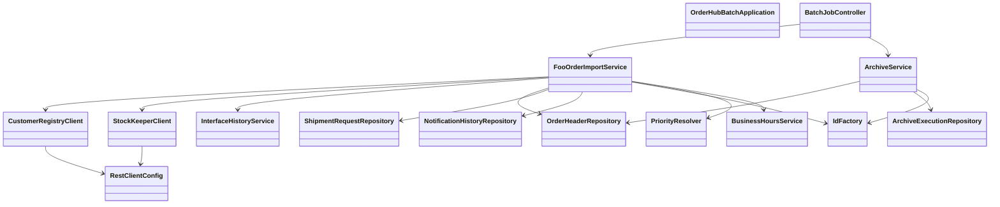

# CLD-001 Batchモジュールクラス設計書

## 1. 基本情報
| 項目 | 内容 |
| --- | --- |
| クラス設計書ID | `CLD-001` |
| 対応処理機能ID | `PGD-001`, `PGD-007` |
| 対象モジュール | `java/hoge-orderhub-batch` |
| 主な責務 | Foo注文取込、日次アーカイブ、社内APIクライアント呼出 |

## 2. クラス一覧
| 区分 | クラス | 役割 |
| --- | --- | --- |
| Application | `OrderHubBatchApplication` | Spring Boot 起動点 |
| Config | `RestClientConfig` | `RestClient.Builder` 提供 |
| Controller | `BatchJobController` | 内部ジョブ起動エンドポイント |
| Service | `FooOrderImportService` | Foo注文取込、注文登録、受付通知生成 |
| Service | `ArchiveService` | 日次アーカイブ実行 |
| Service | `CustomerRegistryClient` | 顧客確認APIクライアント |
| Service | `StockKeeperClient` | 在庫引当APIクライアント |
| Service | `InterfaceHistoryService` | IF履歴記録共通処理 |

## 3. クラス依存図

## 4. 責務分割方針
- `BatchJobController` はジョブ起動要求の受け口に限定し、業務処理を持たない。
- `FooOrderImportService` は現在、入力検証、外部API呼出、DB登録、通知ファイル出力をまとめて持つ。
- `ArchiveService` は抽出、ファイル出力、実行履歴登録を1クラスで担当する。
- `CustomerRegistryClient`、`StockKeeperClient` は外部I/F呼出専用とし、DTO変換に責務を限定する。

## 5. 実装上の注意点
- `FooOrderImportService` は多責務で、将来的には `FooOrderValidator`、`FooOrderRegistrationService`、`FooAckPublisher` への分割候補である。
- `ArchiveService` は将来S3保管へ切り替える場合、`ArchiveWriter` の分離が有効である。
- `RestClientConfig` は batch / gateway で同型実装になっており、共通化余地がある。
