# CLD-002 Workerモジュールクラス設計書

## 1. 基本情報
| 項目 | 内容 |
| --- | --- |
| クラス設計書ID | `CLD-002` |
| 対応処理機能ID | `PGD-002`, `PGD-003` |
| 対象モジュール | `java/hoge-orderhub-worker` |
| 主な責務 | Bar出荷依頼送信、Foo配送結果返却、スケジューラ制御 |

## 2. クラス一覧
| 区分 | クラス | 役割 |
| --- | --- | --- |
| Application | `OrderHubWorkerApplication` | Spring Boot 起動点 |
| Config | `SchedulingConfig` | スケジューラ有効化 |
| Controller | `WorkerController` | 内部Worker手動起動 |
| Service | `ShipmentDispatchWorkerService` | Bar送信待ち案件処理 |
| Service | `FooStatusNotificationWorkerService` | Foo向け配送結果返却 |
| Service | `MockBarDeliveryClient` | Bar配送APIモッククライアント |
| Service | `InterfaceHistoryService` | IF履歴記録 |

## 3. クラス依存図

```mermaid
classDiagram
    class OrderHubWorkerApplication
    class SchedulingConfig
    class WorkerController
    class ShipmentDispatchWorkerService
    class FooStatusNotificationWorkerService
    class MockBarDeliveryClient
    class InterfaceHistoryService
    class ShipmentRequestRepository
    class OrderHeaderRepository
    class OrderLineRepository
    class BarIdempotencyHistoryRepository
    class NotificationHistoryRepository
    class DeliveryStatusCurrentRepository
    class BusinessHoursService
    class IdFactory

    WorkerController --> ShipmentDispatchWorkerService
    WorkerController --> FooStatusNotificationWorkerService
    ShipmentDispatchWorkerService --> ShipmentRequestRepository
    ShipmentDispatchWorkerService --> OrderHeaderRepository
    ShipmentDispatchWorkerService --> OrderLineRepository
    ShipmentDispatchWorkerService --> BarIdempotencyHistoryRepository
    ShipmentDispatchWorkerService --> NotificationHistoryRepository
    ShipmentDispatchWorkerService --> MockBarDeliveryClient
    ShipmentDispatchWorkerService --> InterfaceHistoryService
    ShipmentDispatchWorkerService --> BusinessHoursService
    ShipmentDispatchWorkerService --> IdFactory
    FooStatusNotificationWorkerService --> NotificationHistoryRepository
    FooStatusNotificationWorkerService --> OrderHeaderRepository
    FooStatusNotificationWorkerService --> DeliveryStatusCurrentRepository
    FooStatusNotificationWorkerService --> InterfaceHistoryService
```

## 4. 責務分割方針
- `WorkerController` は手動実行APIのみを持ち、業務本体はServiceへ委譲する。
- `ShipmentDispatchWorkerService` は抽出、営業時間判定、Bar送信、通知起票までをまとめて担当する。
- `FooStatusNotificationWorkerService` は通知履歴抽出とファイル返却に責務を絞る。
- `MockBarDeliveryClient` は現在はモックだが、本番接続時は `BarDeliveryClient` へ差し替え可能な位置づけとする。

## 5. 実装上の注意点
- `ShipmentDispatchWorkerService` は本来メッセージ受信単位で閉じる設計だが、現実装はスケジュール + DBポーリング型である。
- Baz/Qux通知は通知履歴生成までで、実キュー投入責務がコード上に現れていない。
- `FooStatusNotificationWorkerService` のファイル出力は HULFT 送信要求キューを介しておらず、簡易実装寄りである。
