# CLD-002 Workerモジュールクラス設計書

## 1. 基本情報
| 項目 | 内容 |
| --- | --- |
| クラス設計書ID | `CLD-002` |
| 対応処理機能ID | `PGD-002`, `PGD-003` |
| 対象モジュール | `java/hoge-orderhub-worker` |
| 主な責務 | SQS受信による配送会社出荷依頼送信、Baz/Qux通知投入、Foo配送結果返却、返却処理のスケジューラ制御 |

## 2. クラス一覧
| 区分 | クラス | 役割 |
| --- | --- | --- |
| Application | `OrderHubWorkerApplication` | Spring Boot 起動点 |
| Config | `SchedulingConfig` | Foo配送結果返却処理のスケジューラ有効化 |
| Controller | `WorkerController` | 内部Worker手動起動 |
| Service | `ShipmentDispatchWorkerService` | 配送会社送信待ちキューから受信した1件の送信処理 |
| Service | `FooStatusNotificationWorkerService` | Foo向け配送結果返却 |
| Client | `CarrierDeliveryClient` | 配送会社向け出荷依頼クライアントの共通インターフェース |
| Client | `BarDeliveryClient` | Bar社向け出荷依頼APIクライアント |
| Client | `FugaDeliveryClient` | Fuga社向け出荷依頼APIクライアント |
| Publisher | `BillingNotificationPublisher` | Baz向け請求予定メッセージを `billing-plan-queue` へ投入 |
| Publisher | `OrderNotificationPublisher` | Qux向け注文状態メッセージを `order-notice-queue.fifo` へ投入 |
| Service | `HulftTransferRequestService` | Foo向け返却ファイルをS3へ出力し、HULFT送信要求を登録 |
| Service | `InterfaceHistoryService` | IF履歴記録 |

## 3. クラス依存図

```mermaid
classDiagram
    class OrderHubWorkerApplication
    class SchedulingConfig
    class WorkerController
    class ShipmentDispatchWorkerService
    class FooStatusNotificationWorkerService
    class CarrierDeliveryClient
    class BarDeliveryClient
    class FugaDeliveryClient
    class BillingNotificationPublisher
    class OrderNotificationPublisher
    class HulftTransferRequestService
    class InterfaceHistoryService
    class ShipmentRequestRepository
    class OrderHeaderRepository
    class OrderLineRepository
    class BarIdempotencyHistoryRepository
    class NotificationHistoryRepository
    class DeliveryStatusCurrentRepository
    class BusinessHoursService
    class IdFactory

    WorkerController --> ShipmentDispatchWorkerService
    WorkerController --> FooStatusNotificationWorkerService
    ShipmentDispatchWorkerService --> ShipmentRequestRepository
    ShipmentDispatchWorkerService --> OrderHeaderRepository
    ShipmentDispatchWorkerService --> OrderLineRepository
    ShipmentDispatchWorkerService --> BarIdempotencyHistoryRepository
    ShipmentDispatchWorkerService --> NotificationHistoryRepository
    ShipmentDispatchWorkerService --> CarrierDeliveryClient
    CarrierDeliveryClient <|.. BarDeliveryClient
    CarrierDeliveryClient <|.. FugaDeliveryClient
    ShipmentDispatchWorkerService --> BillingNotificationPublisher
    ShipmentDispatchWorkerService --> OrderNotificationPublisher
    ShipmentDispatchWorkerService --> InterfaceHistoryService
    ShipmentDispatchWorkerService --> BusinessHoursService
    ShipmentDispatchWorkerService --> IdFactory
    FooStatusNotificationWorkerService --> NotificationHistoryRepository
    FooStatusNotificationWorkerService --> OrderHeaderRepository
    FooStatusNotificationWorkerService --> DeliveryStatusCurrentRepository
    FooStatusNotificationWorkerService --> HulftTransferRequestService
    FooStatusNotificationWorkerService --> InterfaceHistoryService
```

## 4. 責務分割方針
- `WorkerController` は手動実行APIのみを持ち、業務本体はServiceへ委譲する。
- `ShipmentDispatchWorkerService` はSQSメッセージ1件を処理単位とし、配送解放判定、Bar営業時間判定、配送会社送信、通知登録と投入結果制御までを担当する。
- `FooStatusNotificationWorkerService` は通知履歴抽出とファイル返却に責務を絞る。
- 配送会社別のURL、認証、電文編集差異は `BarDeliveryClient` と `FugaDeliveryClient` に閉じ込め、Worker本体は `CarrierDeliveryClient` を介して呼び出す。
- Baz/Qux向けメッセージ編集とSQS投入は各Publisherへ分離し、Worker本体は通知条件と通知履歴状態を制御する。
- Foo向け配送結果返却は `HulftTransferRequestService` により返却ファイル出力とHULFT送信要求登録を行い、HULFT送信結果に応じて通知履歴を更新する。

## 5. 実装上の注意点
- `ShipmentDispatchWorkerService` は `bar-shipment-request-queue.fifo` / `fuga-shipment-request-queue.fifo` から受信した送信要求1件単位で処理を閉じる前提とする。
- Bar向け出荷依頼成功時はBaz請求予定通知を投入し、Foo注文の場合に限りQux注文状態通知も投入する。
- Baz/Qux向けキュー投入失敗時は通知履歴を `ERROR` とし、配送会社APIを再送せず通知だけを再送する。
- `FooStatusNotificationWorkerService` はファイル生成要求をHULFT送信処理へ引き渡し、送信成功確認前に通知履歴を `SENT` にしない。
