# CLD-003 Gatewayモジュールクラス設計書

## 1. 基本情報
| 項目 | 内容 |
| --- | --- |
| クラス設計書ID | `CLD-003` |
| 対応処理機能ID | `PGD-004`, `PGD-005`, `PGD-006`, `PGD-008` |
| 対象モジュール | `java/hoge-shipping-gateway-api` |
| 主な責務 | Hoge直受注登録、出荷状態照会、Bar/Fuga配送結果受付、配送状態非同期反映、未出荷取消 |

## 2. クラス一覧
| 区分 | クラス | 役割 |
| --- | --- | --- |
| Application | `ShippingGatewayApplication` | Spring Boot 起動点 |
| Config | `RestClientConfig` | `RestClient.Builder` 提供 |
| Controller | `ShipmentGatewayController` | 対外APIのHTTP入口 |
| ControllerAdvice | `GlobalApiExceptionHandler` | 共通例外応答変換・監視ログ出力 |
| Service | `ShipmentRegistrationService` | Hoge直受注登録 |
| Service | `ShipmentStatusQueryService` | 出荷状態照会 |
| Service | `DeliveryResultReceptionService` | Bar/Fuga配送結果の検証、受付監査、状態反映要求の登録 |
| Service | `DeliveryStatusReflectionService` | 状態反映要求1件の配送状態更新、在庫出荷確定、後続通知 |
| Dispatcher | `DeliveryStatusReflectionDispatcher` | 受付処理から配送状態取込Workerへの状態反映要求引継ぎ |
| Publisher | `BillingNotificationPublisher` | Baz向け確定請求メッセージを `billing-plan-queue` へ投入 |
| Publisher | `OrderNotificationPublisher` | Qux向け注文状態メッセージを `order-notice-queue.fifo` へ投入 |
| Service | `ShipmentCancellationService` | 未出荷注文取消、在庫引当解除 |
| Service | `CustomerRegistryClient` | 顧客確認APIクライアント |
| Service | `StockKeeperClient` | 在庫引当APIクライアント |
| Service | `InterfaceHistoryService` | IF履歴記録 |

## 3. クラス依存図

```mermaid
classDiagram
    class ShippingGatewayApplication
    class RestClientConfig
    class ShipmentGatewayController
    class GlobalApiExceptionHandler
    class ShipmentRegistrationService
    class ShipmentStatusQueryService
    class DeliveryResultReceptionService
    class DeliveryStatusReflectionService
    class DeliveryStatusReflectionDispatcher
    class BillingNotificationPublisher
    class OrderNotificationPublisher
    class ShipmentCancellationService
    class CustomerRegistryClient
    class StockKeeperClient
    class InterfaceHistoryService
    class OrderHeaderRepository
    class OrderLineRepository
    class ShipmentRequestRepository
    class DeliveryStatusCurrentRepository
    class DeliveryStatusHistoryRepository
    class NotificationHistoryRepository
    class BusinessHoursService
    class IdFactory
    class StatusMapper

    ShipmentGatewayController --> ShipmentRegistrationService
    ShipmentGatewayController --> ShipmentStatusQueryService
    ShipmentGatewayController --> DeliveryResultReceptionService
    ShipmentGatewayController --> ShipmentCancellationService
    ShipmentRegistrationService --> OrderHeaderRepository
    ShipmentRegistrationService --> OrderLineRepository
    ShipmentRegistrationService --> ShipmentRequestRepository
    ShipmentRegistrationService --> CustomerRegistryClient
    ShipmentRegistrationService --> StockKeeperClient
    ShipmentRegistrationService --> BusinessHoursService
    ShipmentRegistrationService --> IdFactory
    ShipmentRegistrationService --> InterfaceHistoryService
    ShipmentStatusQueryService --> OrderHeaderRepository
    ShipmentStatusQueryService --> ShipmentRequestRepository
    ShipmentStatusQueryService --> DeliveryStatusCurrentRepository
    ShipmentStatusQueryService --> InterfaceHistoryService
    DeliveryResultReceptionService --> OrderHeaderRepository
    DeliveryResultReceptionService --> DeliveryStatusCurrentRepository
    DeliveryResultReceptionService --> InterfaceHistoryService
    DeliveryResultReceptionService --> DeliveryStatusReflectionDispatcher
    DeliveryResultReceptionService --> IdFactory
    DeliveryResultReceptionService --> StatusMapper
    DeliveryStatusReflectionDispatcher --> DeliveryStatusReflectionService
    DeliveryStatusReflectionService --> OrderHeaderRepository
    DeliveryStatusReflectionService --> DeliveryStatusCurrentRepository
    DeliveryStatusReflectionService --> DeliveryStatusHistoryRepository
    DeliveryStatusReflectionService --> NotificationHistoryRepository
    DeliveryStatusReflectionService --> StockKeeperClient
    DeliveryStatusReflectionService --> BillingNotificationPublisher
    DeliveryStatusReflectionService --> OrderNotificationPublisher
    DeliveryStatusReflectionService --> InterfaceHistoryService
    DeliveryStatusReflectionService --> StatusMapper
    ShipmentCancellationService --> OrderHeaderRepository
    ShipmentCancellationService --> ShipmentRequestRepository
    ShipmentCancellationService --> StockKeeperClient
    ShipmentCancellationService --> InterfaceHistoryService
    CustomerRegistryClient --> RestClientConfig
    StockKeeperClient --> RestClientConfig
```

## 4. 層構造方針
- `ShipmentGatewayController` はHTTP入出力とヘッダ受け渡しに限定する。
- 業務判定は `ShipmentRegistrationService`、`ShipmentStatusQueryService`、`DeliveryResultReceptionService`、`DeliveryStatusReflectionService`、`ShipmentCancellationService` に分離する。
- `DeliveryResultReceptionService` は受付監査と状態反映要求の登録までを担当し、注文・配送状態を直接更新しない。
- `DeliveryStatusReflectionService` は配送状態取込Workerの処理本体として、状態更新、Bar初回受付時の在庫出荷確定、Foo通知起票、Baz通知投入、およびFoo注文に限定したQux通知投入を担当する。
- 外部社内API呼出は `CustomerRegistryClient`、`StockKeeperClient` に閉じ込める。
- 例外応答整形と監視ログ出力は共通 `GlobalApiExceptionHandler` に集約する。

## 5. 実装上の注意点
- `ShipmentStatusQueryService` は現在、Foo社状態照会とHoge社業務確認の双方で利用されるため、許可クライアントごとの参照条件整理が必要である。
- 配送結果受付APIと配送状態取込Workerは同一ECSサービス内に配置するが、`DeliveryStatusReflectionDispatcher` を境界として同期受付処理と非同期状態反映処理を分離する。
- Baz/Qux向けキュー投入失敗時は通知履歴を `ERROR` とし、配送状態更新をロールバックせず通知だけを再送する。
- `ShipmentCancellationService` は内部運用API専用であり、外部公開APIと同一認証方式を使わない前提で `X-Client-System-Id=HOGE-OPS-PORTAL` を要求する。
- `ShipmentGatewayController` は正常な新規イベントと同一内容再送に `202 Accepted` を返す。旧 `status_seq` はBar社には `202`、Fuga社には `409 Conflict` を返し、入力不正には `400`、同一イベント内容相違と状態遷移不正には配送会社を問わず `409` を返却できる応答型とする。
