# CLD-003 Gatewayモジュールクラス設計書

## 1. 基本情報
| 項目 | 内容 |
| --- | --- |
| クラス設計書ID | `CLD-003` |
| 対応処理機能ID | `PGD-004`, `PGD-005`, `PGD-006`, `PGD-008` |
| 対象モジュール | `java/hoge-shipping-gateway-api` |
| 主な責務 | Hoge直受注登録、出荷状態照会、Bar/Fuga配送結果受信、未出荷取消 |

## 2. クラス一覧
| 区分 | クラス | 役割 |
| --- | --- | --- |
| Application | `ShippingGatewayApplication` | Spring Boot 起動点 |
| Config | `RestClientConfig` | `RestClient.Builder` 提供 |
| Controller | `ShipmentGatewayController` | 対外APIのHTTP入口 |
| Controller | `ApiExceptionHandler` | 例外応答変換 |
| Service | `ShipmentRegistrationService` | Hoge直受注登録 |
| Service | `ShipmentStatusQueryService` | 出荷状態照会 |
| Service | `BarDeliveryResultService` | Bar/Fuga配送結果受信・状態反映 |
| Service | `ShipmentCancellationService` | 未出荷注文取消、在庫引当解除 |
| Service | `CustomerRegistryClient` | 顧客確認APIクライアント |
| Service | `StockKeeperClient` | 在庫引当APIクライアント |
| Service | `InterfaceHistoryService` | IF履歴記録 |

## 3. クラス依存図

```mermaid
classDiagram
    class ShippingGatewayApplication
    class RestClientConfig
    class ShipmentGatewayController
    class ApiExceptionHandler
    class ShipmentRegistrationService
    class ShipmentStatusQueryService
    class BarDeliveryResultService
    class ShipmentCancellationService
    class CustomerRegistryClient
    class StockKeeperClient
    class InterfaceHistoryService
    class OrderHeaderRepository
    class OrderLineRepository
    class ShipmentRequestRepository
    class DeliveryStatusCurrentRepository
    class DeliveryStatusHistoryRepository
    class NotificationHistoryRepository
    class BusinessHoursService
    class IdFactory
    class StatusMapper

    ShipmentGatewayController --> ShipmentRegistrationService
    ShipmentGatewayController --> ShipmentStatusQueryService
    ShipmentGatewayController --> BarDeliveryResultService
    ShipmentGatewayController --> ShipmentCancellationService
    ShipmentRegistrationService --> OrderHeaderRepository
    ShipmentRegistrationService --> OrderLineRepository
    ShipmentRegistrationService --> ShipmentRequestRepository
    ShipmentRegistrationService --> CustomerRegistryClient
    ShipmentRegistrationService --> StockKeeperClient
    ShipmentRegistrationService --> BusinessHoursService
    ShipmentRegistrationService --> IdFactory
    ShipmentRegistrationService --> InterfaceHistoryService
    ShipmentStatusQueryService --> OrderHeaderRepository
    ShipmentStatusQueryService --> ShipmentRequestRepository
    ShipmentStatusQueryService --> DeliveryStatusCurrentRepository
    ShipmentStatusQueryService --> InterfaceHistoryService
    BarDeliveryResultService --> OrderHeaderRepository
    BarDeliveryResultService --> DeliveryStatusCurrentRepository
    BarDeliveryResultService --> DeliveryStatusHistoryRepository
    BarDeliveryResultService --> NotificationHistoryRepository
    BarDeliveryResultService --> InterfaceHistoryService
    BarDeliveryResultService --> IdFactory
    BarDeliveryResultService --> StatusMapper
    ShipmentCancellationService --> OrderHeaderRepository
    ShipmentCancellationService --> ShipmentRequestRepository
    ShipmentCancellationService --> StockKeeperClient
    ShipmentCancellationService --> InterfaceHistoryService
    CustomerRegistryClient --> RestClientConfig
    StockKeeperClient --> RestClientConfig
```

## 4. 層構造方針
- `ShipmentGatewayController` はHTTP入出力とヘッダ受け渡しに限定する。
- 業務判定は `ShipmentRegistrationService`、`ShipmentStatusQueryService`、`BarDeliveryResultService`、`ShipmentCancellationService` に分離する。
- 外部社内API呼出は `CustomerRegistryClient`、`StockKeeperClient` に閉じ込める。
- 例外応答整形は `ApiExceptionHandler` に集約する。

## 5. 実装上の注意点
- `ShipmentStatusQueryService` は現在、Foo社状態照会とHoge社業務確認の双方で利用されるため、許可クライアントごとの参照条件整理が必要である。
- `BarDeliveryResultService` は「受信」と「状態反映」が同居しており、本来の `PDS-004` / `PDS-005` 分離とはギャップがある。現行詳細設計では Bar/Fuga の両通知を同一責務で扱う前提とする。
- `ShipmentCancellationService` は内部運用API専用であり、外部公開APIと同一認証方式を使わない前提で `X-Client-System-Id=HOGE-OPS-PORTAL` を要求する。
- `ShipmentGatewayController` は `POST /delivery-results/bar` および `POST /delivery-results/fuga` で `void` を返し、受理応答はアノテーションで固定している。
