# CLD-003 Gatewayモジュールクラス設計書

## 1. 基本情報
| 項目 | 内容 |
| --- | --- |
| クラス設計書ID | `CLD-003` |
| 対応処理機能ID | `PGD-004`, `PGD-005`, `PGD-006` |
| 対象モジュール | `java/hoge-shipping-gateway-api` |
| 主な責務 | Fuga出荷依頼受付、出荷状態照会、Bar配送結果受信 |

## 2. クラス一覧
| 区分 | クラス | 役割 |
| --- | --- | --- |
| Application | `ShippingGatewayApplication` | Spring Boot 起動点 |
| Config | `RestClientConfig` | `RestClient.Builder` 提供 |
| Controller | `ShipmentGatewayController` | 対外APIのHTTP入口 |
| Controller | `ApiExceptionHandler` | 例外応答変換 |
| Service | `ShipmentRegistrationService` | Fuga出荷依頼受付 |
| Service | `ShipmentStatusQueryService` | 出荷状態照会 |
| Service | `BarDeliveryResultService` | Bar配送結果受信・状態反映 |
| Service | `CustomerRegistryClient` | 顧客確認APIクライアント |
| Service | `StockKeeperClient` | 在庫引当APIクライアント |
| Service | `InterfaceHistoryService` | IF履歴記録 |

## 3. クラス依存図

```mermaid
classDiagram
    class ShippingGatewayApplication
    class RestClientConfig
    class ShipmentGatewayController
    class ApiExceptionHandler
    class ShipmentRegistrationService
    class ShipmentStatusQueryService
    class BarDeliveryResultService
    class CustomerRegistryClient
    class StockKeeperClient
    class InterfaceHistoryService
    class OrderHeaderRepository
    class OrderLineRepository
    class ShipmentRequestRepository
    class DeliveryStatusCurrentRepository
    class DeliveryStatusHistoryRepository
    class NotificationHistoryRepository
    class BusinessHoursService
    class IdFactory
    class StatusMapper

    ShipmentGatewayController --> ShipmentRegistrationService
    ShipmentGatewayController --> ShipmentStatusQueryService
    ShipmentGatewayController --> BarDeliveryResultService
    ShipmentRegistrationService --> OrderHeaderRepository
    ShipmentRegistrationService --> OrderLineRepository
    ShipmentRegistrationService --> ShipmentRequestRepository
    ShipmentRegistrationService --> CustomerRegistryClient
    ShipmentRegistrationService --> StockKeeperClient
    ShipmentRegistrationService --> BusinessHoursService
    ShipmentRegistrationService --> IdFactory
    ShipmentRegistrationService --> InterfaceHistoryService
    ShipmentStatusQueryService --> OrderHeaderRepository
    ShipmentStatusQueryService --> ShipmentRequestRepository
    ShipmentStatusQueryService --> DeliveryStatusCurrentRepository
    ShipmentStatusQueryService --> InterfaceHistoryService
    BarDeliveryResultService --> OrderHeaderRepository
    BarDeliveryResultService --> DeliveryStatusCurrentRepository
    BarDeliveryResultService --> DeliveryStatusHistoryRepository
    BarDeliveryResultService --> NotificationHistoryRepository
    BarDeliveryResultService --> InterfaceHistoryService
    BarDeliveryResultService --> IdFactory
    BarDeliveryResultService --> StatusMapper
    CustomerRegistryClient --> RestClientConfig
    StockKeeperClient --> RestClientConfig
```

## 4. 層構造方針
- `ShipmentGatewayController` はHTTP入出力とヘッダ受け渡しに限定する。
- 業務判定は `ShipmentRegistrationService`、`ShipmentStatusQueryService`、`BarDeliveryResultService` に分離する。
- 外部社内API呼出は `CustomerRegistryClient`、`StockKeeperClient` に閉じ込める。
- 例外応答整形は `ApiExceptionHandler` に集約する。

## 5. 実装上の注意点
- `ShipmentStatusQueryService` は現在、Foo/Fugaの呼出元別制約を持たず、キー解決がやや広い。
- `BarDeliveryResultService` は「受信」と「状態反映」が同居しており、本来の `PDS-004` / `PDS-005` 分離とはギャップがある。
- `ShipmentGatewayController` は `POST /delivery-results/bar` で `void` を返し、受理応答はアノテーションで固定している。
