# CLD-004 StockKeeperモジュールクラス設計書

## 1. 基本情報
| 項目 | 内容 |
| --- | --- |
| クラス設計書ID | `CLD-004` |
| 対応処理機能ID | `PGD-009` |
| 対象モジュール | `java/hoge-stock-keeper-api` |
| 主な責務 | 在庫引当、引当解除、出荷確定、倉庫在庫照会、入庫登録 |

## 2. クラス一覧
| 区分 | クラス | 役割 |
| --- | --- | --- |
| Application | `StockKeeperApplication` | Spring Boot 起動点 |
| Config | `StockSeedData` | 初期在庫・マスタ投入設定 |
| Controller | `StockReservationController` | OrderHub系の在庫引当、引当解除、出荷確定のHTTP入口 |
| Controller | `WarehouseStockController` | 倉庫在庫照会、入庫登録のHTTP入口 |
| Service | `StockReservationService` | 在庫引当、引当解除、出荷確定 |
| Service | `WarehouseInventoryService` | 倉庫在庫照会 |
| Service | `StockReceiptService` | 入庫登録、冪等制御、監査履歴記録 |
| Service | `WarehouseAuthorizationService` | 倉庫担当者スコープ判定 |

## 3. クラス依存図

```mermaid
classDiagram
    class StockKeeperApplication
    class StockSeedData
    class StockReservationController
    class WarehouseStockController
    class StockReservationService
    class WarehouseInventoryService
    class StockReceiptService
    class WarehouseAuthorizationService
    class StockItemRepository
    class StockReservationLedgerRepository
    class WarehouseLocationRepository
    class WarehouseStaffScopeRepository
    class StockBalanceRepository
    class StockReceiptHistoryRepository
    class StockTransactionRepository
    class IdFactory
    class StockResponseMapper

    StockReservationController --> StockReservationService
    WarehouseStockController --> WarehouseInventoryService
    WarehouseStockController --> StockReceiptService
    WarehouseInventoryService --> WarehouseAuthorizationService
    WarehouseInventoryService --> WarehouseLocationRepository
    WarehouseInventoryService --> StockItemRepository
    WarehouseInventoryService --> StockBalanceRepository
    StockReceiptService --> WarehouseAuthorizationService
    StockReceiptService --> WarehouseLocationRepository
    StockReceiptService --> StockItemRepository
    StockReceiptService --> StockBalanceRepository
    StockReceiptService --> StockReceiptHistoryRepository
    StockReceiptService --> StockTransactionRepository
    StockReceiptService --> IdFactory
    StockReservationService --> StockReservationLedgerRepository
    StockReservationService --> StockBalanceRepository
    StockReservationService --> StockTransactionRepository
    StockReservationService --> IdFactory
```

## 4. 責務分割方針
- `StockReservationController` は OrderHub から呼ばれる社内参照APIを受け付け、在庫引当ライフサイクルに関する責務だけを持つ。
- `WarehouseStockController` は倉庫担当者向け API を受け付け、照会系と更新系を `WarehouseInventoryService`、`StockReceiptService` に分離する。
- `WarehouseAuthorizationService` は `employee_id + warehouse_location_code` による担当倉庫場所判定を一元化する。
- リポジトリ層は、在庫残高、引当台帳、入庫履歴、監査履歴の永続化責務に限定する。

## 5. 実装上の注意点
- 現行実装は `StockReservationController` / `StockReservationService` を中心とした在庫引当系が先行しており、`WarehouseStockController`、`WarehouseInventoryService`、`StockReceiptService` などは追加実装前提である。
- 入庫登録は `warehouse_location_code + receipt_reference_no` 単位で冪等制御し、同一内容再送は成功再返却、異内容再送は `409 Conflict` とする。
- 在庫照会と入庫登録は、担当倉庫場所スコープ外アクセスを `403 Forbidden` とする。
- `Stock Keeper` は共通 RDS 上の `stockkeeper` スキーマを利用し、`Customer Registry` や `OrderHub` とはスキーマ単位で権限分離する。
