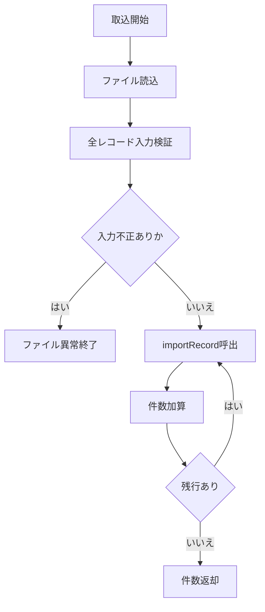
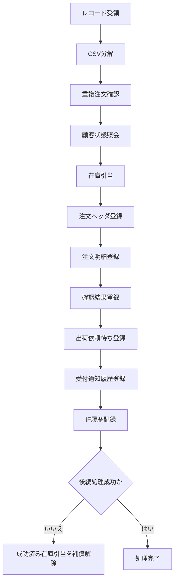

# MTD-001 Foo注文取込・注文受付通知メソッド設計書

## 1. 基本情報
| 項目 | 内容 |
| --- | --- |
| メソッド設計書ID | `MTD-001` |
| 対応処理機能ID | `PGD-001` |
| 対象論理機能 | Foo注文取込・注文受付通知 |
| 関連処理設計書ID | `PDS-001`, `PDS-002` |

## 2. 対象メソッド
| メソッド | 種別 | 説明 |
| --- | --- | --- |
| `importFile(String path)` | `public` | Foo社受信ファイルを読み込み、注文登録と受付通知対象登録を行う。 |
| `importRecord(String csvLine)` | `protected` | ファイル全体の入力検証完了後、1レコード単位で外部照会とDB登録を行う。 |

## 3. `importFile(String path)`
### 3.1 シグネチャ
```java
public int importFile(String path)
```

### 3.2 入出力
| 区分 | 名称 | 型 | 説明 |
| --- | --- | --- | --- |
| 入力 | `path` | `String` | 取込対象ファイルパス |
| 出力 | 戻り値 | `int` | 正常に取込処理へ渡した件数 |

### 3.3 処理概要
1. UTF-8でファイルを全行読み込む。
2. 空行を除外し、全レコードのCSV形式、必須項目、桁数、コード値、項目間整合性を検証する。
3. 入力不正が1件でも存在する場合は、外部API呼出、DB登録、メッセージ送信を行わずファイル異常として終了する。
4. 全レコードが正常な場合のみ、1行ずつ `importRecord` を呼び出す。
5. 正常取込件数を加算し、最終件数を返却する。
6. ファイル読込失敗時は500系例外へ変換する。

### 3.4 フロー図


## 4. `importRecord(String csvLine)`
### 4.1 シグネチャ
```java
protected void importRecord(String csvLine)
```

### 4.2 処理概要
1. 入力検証済みCSVを分解し、注文元、注文種別、優先度、配送条件を解釈する。
2. 顧客マスタ管理APIで顧客状態を確認する。
3. 在庫引当APIで引当可否を確認する。
4. 注文ヘッダ、明細、顧客確認結果、在庫引当結果、出荷依頼待ち情報を登録する。
5. 注文受付通知用の履歴を `PENDING` で登録する。
6. 連携履歴を記録する。
7. 在庫引当成功後、ファイル内の後続レコード処理、DB登録、通知起票、キュー投入で異常終了した場合は、当該ファイル処理で成功済みの引当IDを在庫引当解除APIで補償解除する。

### 4.3 フロー図


### 4.4 主な例外
- 重複注文: `409 Conflict`
- 入力不正: `400 Bad Request`
- 顧客停止、在庫管理上の商品無効、引当不可: 業務エラーとして注文を登録せず、受付通知と配送会社送信要求も起票しない

