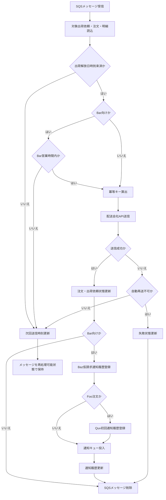

# MTD-002 配送会社連携メソッド設計書

## 1. 基本情報
| 項目 | 内容 |
| --- | --- |
| メソッド設計書ID | `MTD-002` |
| 対応処理機能ID | `PGD-002` |
| 対象論理機能 | 配送会社連携 |
| 関連処理設計書ID | `PDS-003` |

## 2. 対象メソッド
| メソッド | 種別 | 説明 |
| --- | --- | --- |
| `consumeShipmentRequest(ShipmentDispatchMessage message)` | `public` | 配送会社送信待ちキューから受信した1メッセージを処理する入口。 |
| `dispatchShipment(ShipmentDispatchMessage message)` | `public` | 対象の出荷依頼を検証し、配送会社へ連携する。 |

## 3. `consumeShipmentRequest(...)`
### 3.1 シグネチャ
```java
public void consumeShipmentRequest(ShipmentDispatchMessage message)
```

### 3.2 処理概要
1. `bar-shipment-request-queue.fifo` または `fuga-shipment-request-queue.fifo` からメッセージを1件受信する。
2. メッセージの必須項目と配送会社コードを検証する。
3. 実処理として `dispatchShipment` を呼び出す。
4. 配送会社受付成功または自動再送対象外の業務エラー確定時のみ、受信メッセージを削除する。
5. 営業時間外、出荷解放日時未到来、一時障害の場合はメッセージを削除せず、再処理可能状態を維持する。

## 4. `dispatchShipment(...)`
### 4.1 シグネチャ
```java
public DispatchResult dispatchShipment(ShipmentDispatchMessage message)
```

### 4.2 処理概要
1. メッセージの `shipment_request_id` をキーに出荷依頼、注文情報、明細を取得する。
2. 終端状態または送信済みでないことを確認し、重複処理対象なら送信せず終了する。
3. `shipping_release_at` 未到来の場合は次回送信時刻を更新し、待機結果を返す。
4. Bar向け案件で営業時間外の場合は次回営業開始時刻を設定し、営業時間待ち結果を返す。
5. 注文情報、明細、優先配送区分、倉庫場所から配送依頼電文を組み立てる。
6. 冪等キーを算出し、送信履歴を確認する。
7. Bar社またはFuga社APIへ送信し、受付結果に応じて注文状態と出荷依頼状態を更新する。
8. Bar向け送信成功時はBaz仮請求通知を`PENDING`で登録し、Foo注文の場合だけQux初回通知も登録して各SQSキューへ投入する。
9. キュー投入成功時は通知履歴を `SENT`、失敗時は `ERROR` へ更新する。通知失敗では配送会社APIを再送しない。
10. 一時障害時は再送時刻を設定し、再送待ち結果を返す。

### 4.3 フロー図


### 4.4 主な例外
- APIタイムアウト: 再送待ちへ戻す
- 業務エラー応答: 失敗履歴を記録し、注文保留または要確認状態へ更新する

