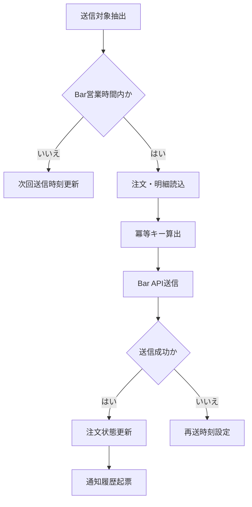

# MTD-002 配送会社連携メソッド設計書

## 1. 基本情報
| 項目 | 内容 |
| --- | --- |
| メソッド設計書ID | `MTD-002` |
| 対応処理機能ID | `PGD-002` |
| 対象論理機能 | 配送会社連携 |
| 関連実装クラス | `jp.co.hoge.orderhubworker.service.ShipmentDispatchWorkerService` |

## 2. 対象メソッド
| メソッド | 種別 | 説明 |
| --- | --- | --- |
| `scheduledDispatch()` | `public` | スケジュール起動の入口。 |
| `dispatchPendingShipments()` | `public` | 出荷依頼待ち案件を抽出し、配送会社へ連携する。 |

## 3. `scheduledDispatch()`
### 3.1 シグネチャ
```java
public void scheduledDispatch()
```

### 3.2 処理概要
1. スケジューラから定期起動される。
2. 実処理として `dispatchPendingShipments` を呼び出す。

## 4. `dispatchPendingShipments()`
### 4.1 シグネチャ
```java
public int dispatchPendingShipments()
```

### 4.2 処理概要
1. `PENDING` または `WAITING_BUSINESS_HOURS` の出荷依頼を抽出する。
2. Bar社営業時間外の場合は次回送信時刻を再計算し、待機状態へ更新する。
3. 注文情報、明細、優先配送区分から配送依頼電文を組み立てる。
4. 冪等キーを算出し、送信履歴を確認する。
5. Bar社APIへ送信し、受付結果に応じて注文状態と出荷依頼状態を更新する。
6. 送信成功時は配送状態履歴通知の起票を行う。
7. 一時障害時は再送時刻を設定し、再送待ちに戻す。

### 4.3 フロー図


### 4.4 主な例外
- APIタイムアウト: 再送待ちへ戻す
- 業務エラー応答: 失敗履歴を記録し、注文保留または要確認状態へ更新する

