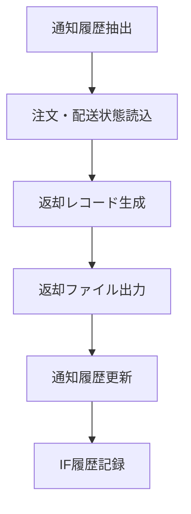

# MTD-003 Foo配送結果返却メソッド設計書

## 1. 基本情報
| 項目 | 内容 |
| --- | --- |
| メソッド設計書ID | `MTD-003` |
| 対応処理機能ID | `PGD-003` |
| 対象論理機能 | Foo配送結果返却 |
| 関連処理設計書ID | `PDS-006` |

## 2. 対象メソッド
| メソッド | 種別 | 説明 |
| --- | --- | --- |
| `scheduledPublish()` | `public` | スケジュール起動の入口。 |
| `publishPendingStatusNotifications()` | `public` | Foo返却対象の配送結果をファイル化し、返却済へ更新する。 |

## 3. `scheduledPublish()`
### 3.1 シグネチャ
```java
public void scheduledPublish()
```

### 3.2 処理概要
1. 定期起動で返却処理を開始する。
2. 実処理として `publishPendingStatusNotifications` を呼び出す。

## 4. `publishPendingStatusNotifications()`
### 4.1 シグネチャ
```java
public int publishPendingStatusNotifications()
```

### 4.2 処理概要
1. Foo返却対象で `PENDING` の通知履歴を抽出する。
2. 注文情報と現在配送状態を参照し、返却レコードを組み立てる。
3. 返却ファイルをHULFT送信用領域へ出力する。
4. 通知履歴を `SENT` へ更新する。
5. 連携履歴を記録する。

### 4.3 フロー図


