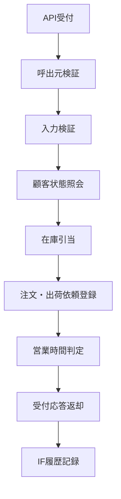

# MTD-004 Fuga出荷依頼受付メソッド設計書

## 1. 基本情報
| 項目 | 内容 |
| --- | --- |
| メソッド設計書ID | `MTD-004` |
| 対応処理機能ID | `PGD-004` |
| 対象論理機能 | Fuga出荷依頼受付 |
| 関連実装クラス | `jp.co.hoge.shippinggateway.service.ShipmentRegistrationService` |

## 2. 対象メソッド
| メソッド | 種別 | 説明 |
| --- | --- | --- |
| `register(FugaShipmentRequest request, String clientSystemId, String requestId, String traceId)` | `public` | Fuga社からの出荷依頼を受け付ける。 |

## 3. `register(...)`
### 3.1 シグネチャ
```java
public FugaShipmentAcceptedResponse register(
        FugaShipmentRequest request,
        String clientSystemId,
        String requestId,
        String traceId
)
```

### 3.2 処理概要
1. 呼出元識別子を検証し、Fuga社以外を拒否する。
2. リクエストの必須項目、数量、配送条件を検証する。
3. 顧客状態と在庫引当結果を確認する。
4. 注文元 `HOGE` の出荷依頼として注文・明細・出荷依頼待ちを登録する。
5. Bar営業時間外の場合は `WAITING_BUSINESS_HOURS` で待機させる。
6. 受付番号を返却し、IF履歴を記録する。

### 3.3 フロー図


