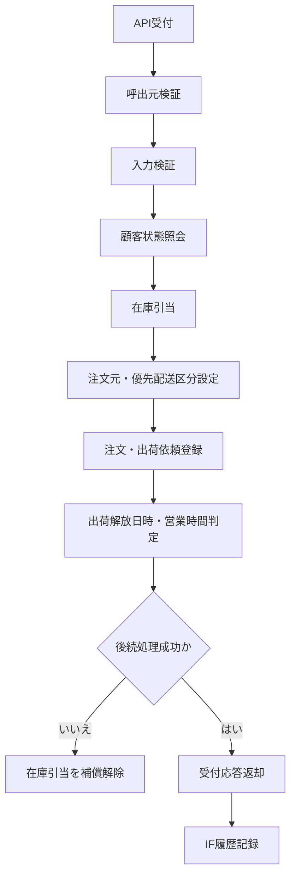

# MTD-004 Hoge直受注登録メソッド設計書

## 1. 基本情報
| 項目 | 内容 |
| --- | --- |
| メソッド設計書ID | `MTD-004` |
| 対応処理機能ID | `PGD-004` |
| 対象論理機能 | Hoge直受注登録 |
| 関連処理設計書ID | `PDS-007` |

## 2. 対象メソッド
| メソッド | 種別 | 説明 |
| --- | --- | --- |
| `register(ShipmentRegistrationRequest request, String clientSystemId, String requestId, String traceId)` | `public` | Hoge社業務部門の直受注を受け付ける。 |

## 3. `register(...)`
### 3.1 シグネチャ
```java
public ShipmentRegistrationAcceptedResponse register(
        ShipmentRegistrationRequest request,
        String clientSystemId,
        String requestId,
        String traceId
)
```

### 3.2 処理概要
1. 呼出元識別子を検証し、直受注登録ポータル以外を拒否する。
2. リクエストの必須項目、数量、配送条件を検証する。
3. 顧客状態と在庫引当結果を確認する。
4. 注文元 `HOGE`、提携先優先度 `0`、優先配送区分 `NORMAL` の出荷依頼として注文・明細・出荷依頼待ちを登録する。
5. `shipping_release_at` 未到来の場合は配送会社を問わず `WAITING_SHIPPING_RELEASE` とし、解放日時まで送信させない。
6. 配送会社がBarで営業時間外の場合は `WAITING_BUSINESS_HOURS` で待機させる。
7. 在庫引当成功後、注文登録コミットまたは配送会社送信待ちメッセージ投入までに失敗した場合は、在庫引当解除APIで補償解除する。
8. 受付番号を返却し、IF履歴を記録する。

### 3.3 フロー図


