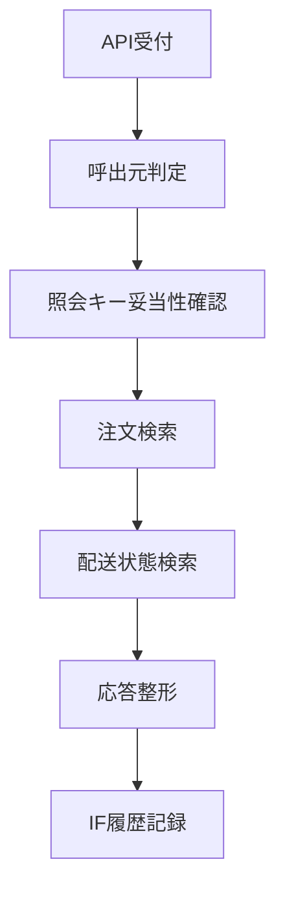

# MTD-005 出荷状態照会メソッド設計書

## 1. 基本情報
| 項目 | 内容 |
| --- | --- |
| メソッド設計書ID | `MTD-005` |
| 対応処理機能ID | `PGD-005` |
| 対象論理機能 | 出荷状態照会 |
| 関連実装クラス | `jp.co.hoge.shippinggateway.service.ShipmentStatusQueryService` |

## 2. 対象メソッド
| メソッド | 種別 | 説明 |
| --- | --- | --- |
| `findStatus(String lookupKey, String clientSystemId, String traceId)` | `public` | 呼出元ごとの照会制約を加味して出荷状態を返却する。 |

## 3. `findStatus(...)`
### 3.1 シグネチャ
```java
public ShipmentStatusResponse findStatus(
        String lookupKey,
        String clientSystemId,
        String traceId
)
```

### 3.2 処理概要
1. 呼出元識別子からFoo/Fugaのどちらかを判定する。
2. FooはHoge採番の注文番号のみ、Fugaはパートナ依頼番号を含めた照会を許可する。
3. 注文情報、出荷依頼情報、現在配送状態を検索する。
4. 見つからない場合は404を返却する。
5. 応答DTOへ整形し、IF履歴を記録する。

### 3.3 フロー図


