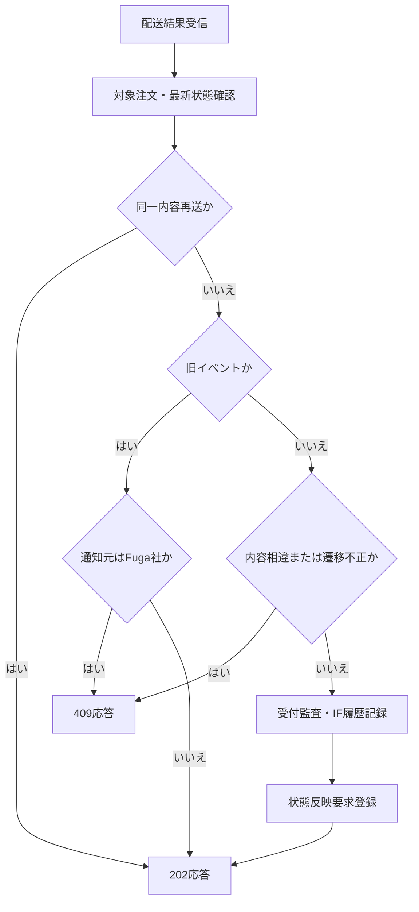
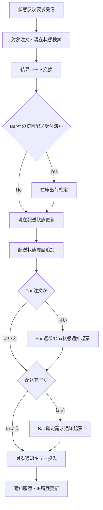

# MTD-006 配送結果受付・配送状態反映メソッド設計書

## 1. 基本情報
| 項目 | 内容 |
| --- | --- |
| メソッド設計書ID | `MTD-006` |
| 対応処理機能ID | `PGD-006` |
| 対象論理機能 | 配送結果受付・配送状態反映 |
| 関連処理設計書ID | `PDS-004`, `PDS-005` |

## 2. 対象メソッド
| メソッド | 種別 | 説明 |
| --- | --- | --- |
| `accept(CarrierDeliveryResultRequest request)` | `public` | Bar社またはFuga社から受信した配送結果を検証し、受付監査と状態反映要求を登録する。 |
| `reflect(DeliveryStatusReflectionRequest request)` | `public` | 状態反映要求1件を受け、配送状態更新、在庫出荷確定、後続通知を行う。 |

## 3. `accept(...)`
### 3.1 シグネチャ
```java
public void accept(CarrierDeliveryResultRequest request)
```

### 3.2 処理概要
1. 配送会社コードを判定し、注文番号と配送会社受付番号の整合性を確認する。
2. 同一イベントの同一内容再送は状態反映要求を作成せず冪等成功として終了する。旧 `status_seq` は状態反映要求を作成せず、Bar社には冪等成功、Fuga社には競合として応答する。
3. 同一イベントの内容相違または状態遷移不正は競合エラーとする。
4. 正常な新規イベントの受付監査とIF履歴を記録する。
5. 配送状態取込Worker向けの状態反映要求を登録し、状態反映完了を待たず受付結果を返す。

`CarrierDeliveryResultRequest` は `carrier_code`、配送会社受付番号、`status_seq`、`delivery_status`、発生日時、理由情報を共通項目とし、Bar社の住所補正情報およびFuga社の温度帯・サイズ区分を会社別拡張項目として保持する。

### 3.3 フロー図


## 4. `reflect(...)`
### 4.1 シグネチャ
```java
public void reflect(DeliveryStatusReflectionRequest request)
```

### 4.2 処理概要
1. 状態反映要求から対象注文、配送会社、配送会社受付番号、`status_seq` を取得する。
2. 配送結果コードをHoge社内部状態へマッピングし、現在値より新しいイベントだけを処理する。
3. Bar社の初回 `配送受付済` 反映時のみ在庫出荷確定を実行する。
4. 現在配送状態と注文状態を更新し、配送状態履歴を追加する。
5. Foo返却通知を `PENDING` で起票する。
6. 配送完了時のBaz確定請求通知を登録し、Foo注文の場合だけ配送状態更新時のQux注文状態通知も`PENDING`で登録して各SQSキューへ投入する。
7. キュー投入成功時は通知履歴を `SENT`、失敗時は `ERROR` へ更新し、IF履歴へ結果を記録する。

### 4.3 フロー図


