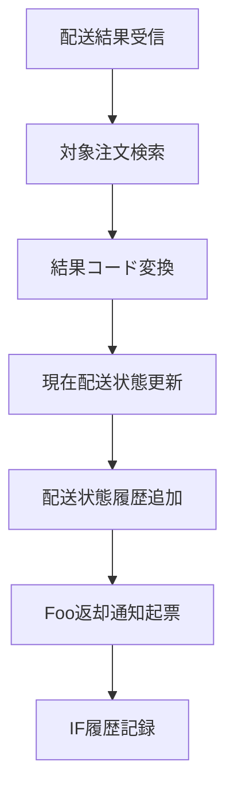

# MTD-006 配送結果受付・配送状態反映メソッド設計書

## 1. 基本情報
| 項目 | 内容 |
| --- | --- |
| メソッド設計書ID | `MTD-006` |
| 対応処理機能ID | `PGD-006` |
| 対象論理機能 | 配送結果受付・配送状態反映 |
| 関連実装クラス | `jp.co.hoge.shippinggateway.service.BarDeliveryResultService` |

## 2. 対象メソッド
| メソッド | 種別 | 説明 |
| --- | --- | --- |
| `accept(BarDeliveryResultRequest request)` | `public` | Bar社から受信した配送結果を業務状態へ反映する。 |

## 3. `accept(...)`
### 3.1 シグネチャ
```java
public void accept(BarDeliveryResultRequest request)
```

### 3.2 処理概要
1. 注文番号と配送会社受付番号の整合性を確認する。
2. 配送結果コードをHoge社内部状態へマッピングする。
3. 現在配送状態を更新し、履歴を追加する。
4. Foo返却対象の通知履歴を起票する。
5. IF履歴を記録する。

### 3.3 フロー図


