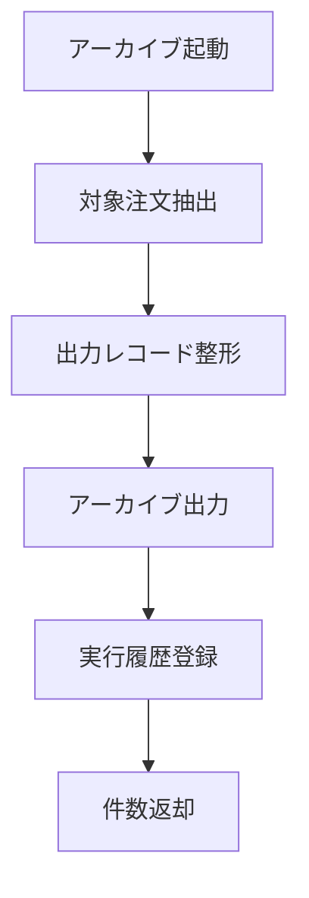

# MTD-007 日次アーカイブメソッド設計書

## 1. 基本情報
| 項目 | 内容 |
| --- | --- |
| メソッド設計書ID | `MTD-007` |
| 対応処理機能ID | `PGD-007` |
| 対象論理機能 | 日次アーカイブ |
| 関連実装クラス | `jp.co.hoge.orderhubbatch.service.ArchiveService` |

## 2. 対象メソッド
| メソッド | 種別 | 説明 |
| --- | --- | --- |
| `archiveCompletedOrders(LocalDateTime threshold)` | `public` | 完了済み注文を抽出し、アーカイブレコードを出力する。 |

## 3. `archiveCompletedOrders(...)`
### 3.1 シグネチャ
```java
public int archiveCompletedOrders(LocalDateTime threshold)
```

### 3.2 処理概要
1. 指定時刻以前に完了した注文を抽出する。
2. 注文、配送結果、請求・通知履歴をアーカイブ対象へ整形する。
3. アーカイブ出力先へ保存する。
4. 実行履歴を登録し、件数を返却する。

### 3.3 フロー図


