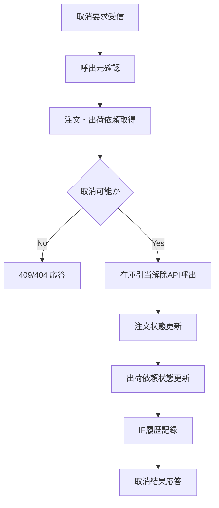

# MTD-008 未出荷取消メソッド設計書

## 1. 基本情報
| 項目 | 内容 |
| --- | --- |
| メソッド設計書ID | `MTD-008` |
| 対応処理機能ID | `PGD-008` |
| 対象論理機能 | 未出荷取消 |
| 関連処理設計書ID | `PDS-010` |

## 2. 対象メソッド
| メソッド | 種別 | 説明 |
| --- | --- | --- |
| `cancel(String orderId, String clientSystemId, String traceId, String cancelReason)` | `public` | 未出荷注文を取消し、必要な在庫解放と状態更新を実施する。 |

## 3. `cancel(...)`
### 3.1 シグネチャ
```java
public ShipmentCancelResponse cancel(
        String orderId,
        String clientSystemId,
        String traceId,
        String cancelReason)
```

### 3.2 処理概要
1. 呼出元が内部運用クライアントであることを確認する。
2. 注文情報と出荷依頼情報を取得する。
3. 取消可能状態かどうかを判定する。
4. 引当済在庫を在庫管理APIで解放する。
5. 注文状態と出荷依頼状態を `CANCELLED` に更新する。
6. IF履歴を記録し、取消結果を返却する。

### 3.3 フロー図

