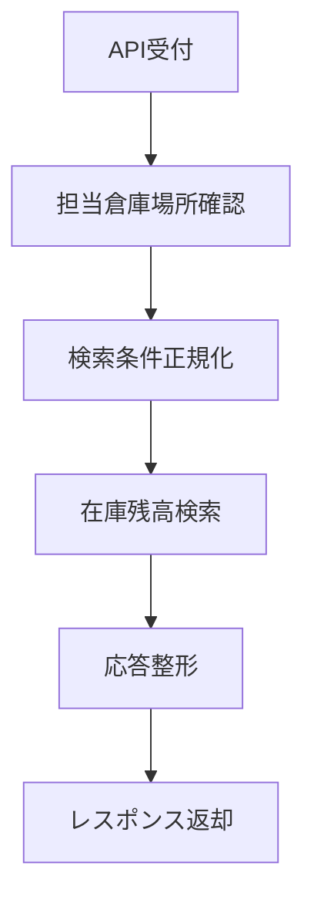
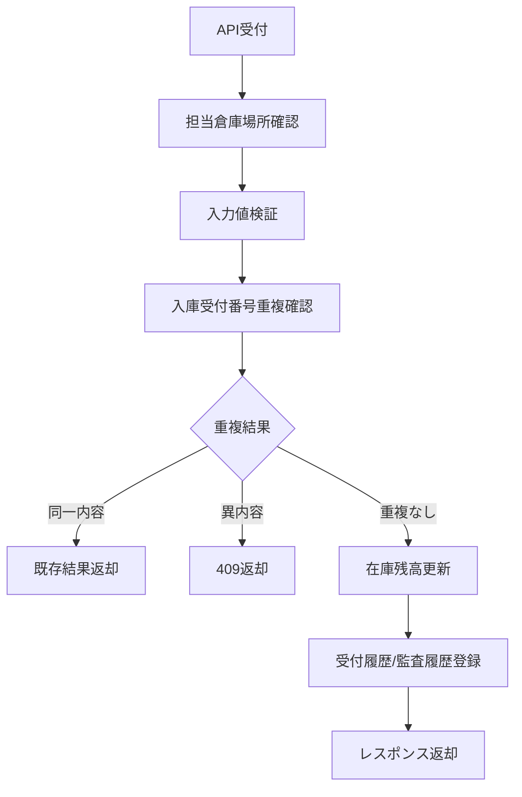

# MTD-009 倉庫在庫照会・入庫登録メソッド設計書

## 1. 基本情報
| 項目 | 内容 |
| --- | --- |
| メソッド設計書ID | `MTD-009` |
| 対応処理機能ID | `PGD-009` |
| 対象論理機能 | 倉庫在庫照会・入庫登録 |
| 関連処理設計書ID | `PDS-011`, `PDS-012` |

## 2. 対象メソッド
| メソッド | 種別 | 説明 |
| --- | --- | --- |
| `searchWarehouseStocks(String employeeId, String warehouseLocationCode, String itemCode, String traceId)` | `public` | 担当倉庫場所に対する在庫一覧を返却する。 |
| `registerStockReceipt(StockReceiptRequest request, String employeeId, String traceId)` | `public` | 倉庫担当者の入庫登録を受け付け、更新後在庫を返却する。 |

## 3. `searchWarehouseStocks(...)`
### 3.1 シグネチャ
```java
public WarehouseStockResponse searchWarehouseStocks(
        String employeeId,
        String warehouseLocationCode,
        String itemCode,
        String traceId
)
```

### 3.2 処理概要
1. `employeeId` の担当倉庫場所に `warehouseLocationCode` が含まれるか確認する。
2. `itemCode` 指定時は対象商品のみ、未指定時は対象倉庫場所の全在庫を取得する。
3. 在庫残高から保有在庫数、引当済在庫数、利用可能在庫数、最終入庫日時を編集する。
4. 空件数も正常応答として返却する。

### 3.3 フロー図


## 4. `registerStockReceipt(...)`
### 4.1 シグネチャ
```java
public StockReceiptResponse registerStockReceipt(
        StockReceiptRequest request,
        String employeeId,
        String traceId
)
```

### 4.2 処理概要
1. `employeeId` の担当倉庫場所に対する登録か確認する。
2. 商品コード、数量、入庫受付番号を検証する。
3. `receipt_reference_no` の重複有無と内容一致を確認する。
4. 重複なしなら在庫残高を更新し、入庫受付履歴と在庫トランザクション履歴を登録する。
5. 更新後在庫を返却する。

### 4.3 フロー図

