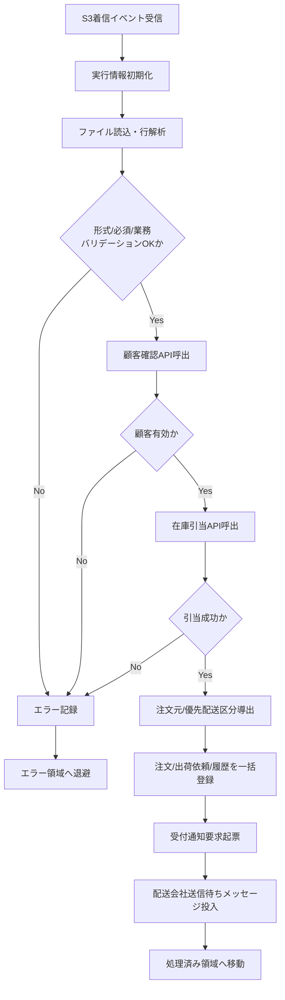

# PDS-001 Foo注文取込Batch処理設計書

## 1. 基本情報
| 項目 | 内容 |
| --- | --- |
| 処理設計書ID | `PDS-001` |
| 関連詳細業務フローID | `DFL-001` |
| 処理名 | Foo注文取込Batch |
| 開始契機 | HULFT受信ファイルのS3着信イベント |
| 終了条件 | 注文登録、受付通知起票、配送会社送信待ちキュー投入が完了すること |

## 2. 処理範囲
Foo社から都度送信された `FOO_ORDER_yyyyMMddHHmmssSSS_NNN.dat` を1ファイル単位で取り込み、入力検証、顧客確認、在庫引当、注文登録、受付通知起票、配送条件判定、配送会社送信待ち要求起票までを行う。

## 3. フロー図

## 4. 処理手順
| 手順 | 内容 | 主な入出力 |
| --- | --- | --- |
| 1 | S3イベントからファイルパス、受信日時、実行IDを取得する | 入力: S3イベント |
| 2 | ファイルを1行ずつ読み込み、CSV列数、`record_type`、必須項目、桁数、コード値を検証する | 入力: 注文ファイル |
| 3 | `order_type`、`priority_level`、`shipping_release_at` から予約注文判定と優先配送区分候補を導出する | 入力: 注文ファイル |
| 4 | 顧客マスタ管理APIで `customer_id` の存在、有効性を確認する | 外部I/F: `IF-HOGE-REG-001` |
| 5 | 在庫管理APIで `item_code`、`quantity` をもとに引当可否を確認する | 外部I/F: `IF-HOGE-STK-001` |
| 6 | 注文ヘッダ、注文明細、顧客確認結果、在庫引当結果、出荷依頼、連携履歴を1トランザクションで登録する | DB: `t_order_header` ほか |
| 7 | 注文受付通知Worker向けの通知履歴を起票する | DB: `th_notification_history` |
| 8 | 配送条件判定結果に応じて `bar-shipment-request-queue.fifo` または `fuga-shipment-request-queue.fifo` へ送信待ちメッセージを投入する | 内部I/F: `bar-shipment-request-queue.fifo`, `fuga-shipment-request-queue.fifo` |
| 9 | 成功時はファイルを処理済み領域へ移動し、失敗時はエラー領域へ移動する | S3 |

## 5. トランザクション・CRUD
| 対象 | CRUD | 内容 |
| --- | --- | --- |
| `t_order_header` | `C/U` | 注文元、注文状態、配送状態、優先配送区分、`shipping_release_at` を登録 |
| `t_order_detail` | `C` | 商品、数量、配送先を登録 |
| `t_shipment_request` | `C/U` | 初期送信待ち状態で出荷依頼を起票 |
| `th_customer_check_history` | `C` | 顧客確認結果を登録 |
| `th_stock_reservation_history` | `C` | 在庫引当結果を登録 |
| `th_notification_history` | `C` | 注文受付通知要求を登録 |
| `th_if_history` | `C/U` | ファイル受付結果、後続起票結果を記録 |

## 6. 完了条件と異常時扱い
- 正常完了は、注文登録コミット済み、受付通知起票済み、配送会社送信待ちメッセージ投入済みであること。
- バリデーション、顧客確認、在庫引当のいずれかで失敗した場合は注文登録を行わず、エラー履歴を記録してファイルをエラー領域へ退避する。
- DB登録後にキュー投入だけ失敗した場合はトランザクションをロールバックし、再実行対象とする。
