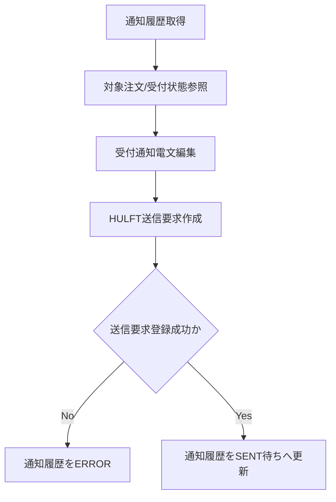

# PDS-002 注文受付通知Worker処理設計書

## 1. 基本情報
| 項目 | 内容 |
| --- | --- |
| 処理設計書ID | `PDS-002` |
| 関連詳細業務フローID | `DFL-001` |
| 処理名 | 注文受付通知Worker |
| 開始契機 | 注文取込完了後の通知履歴起票 |
| 終了条件 | 受付通知ファイル作成要求をHULFT送信へ引き渡し、通知履歴を更新すること |

## 2. フロー図

## 3. 処理手順
| 手順 | 内容 |
| --- | --- |
| 1 | `PENDING` の注文受付通知履歴を取得する |
| 2 | 注文ヘッダ、注文元、受付結果、`shipping_release_at` 有無を参照し、通知コードを決定する |
| 3 | `FOO_ORDER_ACK_yyyyMMddHHmmssSSS_NNN.dat` のレコードを編集する |
| 4 | HULFT送信サーバ向けの送信要求を登録する |
| 5 | 通知履歴にファイル名、要求日時、送信要求結果を更新する |

## 4. 主な編集ルール
- 予約注文かつ `shipping_release_at` 未到来の場合は `RECEIVED_HOLD` を設定する。
- 受付通知は Bar送信成功を意味せず、あくまで Hoge社受付完了のみを示す。
- 1注文につき1回のみ通知し、重複起票があっても最新未送信1件のみを処理対象とする。
