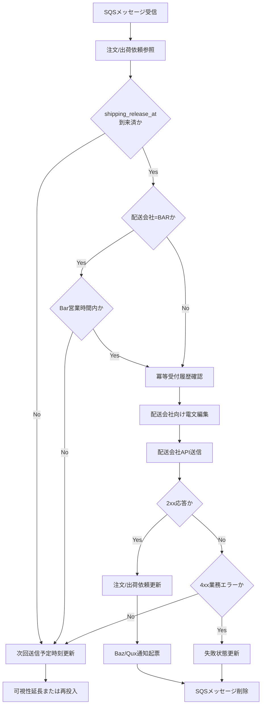

# PDS-003 配送会社連携Worker処理設計書

## 1. 基本情報
| 項目 | 内容 |
| --- | --- |
| 処理設計書ID | `PDS-003` |
| 関連詳細業務フローID | `DFL-001`, `DFL-002` |
| 処理名 | 配送会社連携Worker |
| 開始契機 | `bar-shipment-request-queue.fifo` または `fuga-shipment-request-queue.fifo` から1件受信 |
| 終了条件 | 配送会社向け送信成功後にメッセージ削除、または送信待機制御後に再待機させること |

## 2. 処理範囲
SQSメッセージ1件を読み込み、配送会社コード、Bar社営業時間、`shipping_release_at`、冪等送信条件を判定したうえで、BarまたはFuga向け出荷依頼API送信、または待機延長を行う。

## 3. フロー図

## 4. 処理手順
| 手順 | 内容 |
| --- | --- |
| 1 | SQSメッセージから `shipment_request_id`、`order_id`、送信予定時刻を取得する |
| 2 | 注文ヘッダ、出荷依頼、最新送信履歴を参照し、終端状態や重複送信対象でないことを確認する |
| 3 | `shipping_release_at` 未到来なら送信を行わず、次回送信予定時刻を更新する |
| 4 | 配送会社コードが `BAR` の場合のみ、平日08:00-18:00以外なら営業時間待ちとして可視性タイムアウト延長または再投入する |
| 5 | 配送会社コードに応じて Bar向けまたはFuga向け出荷依頼電文を編集する |
| 6 | 対象配送会社APIへ送信し、2xxなら `ACCEPTED`、4xxなら `FAILED`、5xx/タイムアウトなら再待機扱いとする |
| 7 | 成功時は注文状態、出荷依頼状態、連携履歴を更新し、配送会社別の受付番号を保持したうえで Baz/Qux向け通知を起票する |
| 8 | 成功または業務エラー確定時のみSQSメッセージを削除する |

## 5. メッセージ削除条件
- 2xxで配送会社受付済みになった場合は削除する。
- 4xx業務エラーで自動再送対象外と確定した場合は削除する。
- 営業時間外、`shipping_release_at` 未到来、5xx、タイムアウト時は削除せず、再処理可能状態を維持する。

## 6. 主な更新対象
| 対象 | CRUD | 内容 |
| --- | --- | --- |
| `t_shipment_request` | `R/U` | 待機中、送信済み、失敗を更新 |
| `t_order_header` | `U` | `WAITING_BAR_REQUEST`、`WAITING_FUGA_REQUEST`、`BAR_ACCEPTED`、`FUGA_ACCEPTED` などを更新 |
| `th_if_history` | `C/U` | 配送会社向け送信要求、応答、再待機結果を記録 |
| `t_bar_idempotency_history` | `C` | 配送会社向け冪等送信キーを記録する。物理名はBar連携初版由来だが、現行ではBar/Fuga共通で利用する |
| `th_notification_history` | `C` | Baz/Qux通知要求を起票 |
