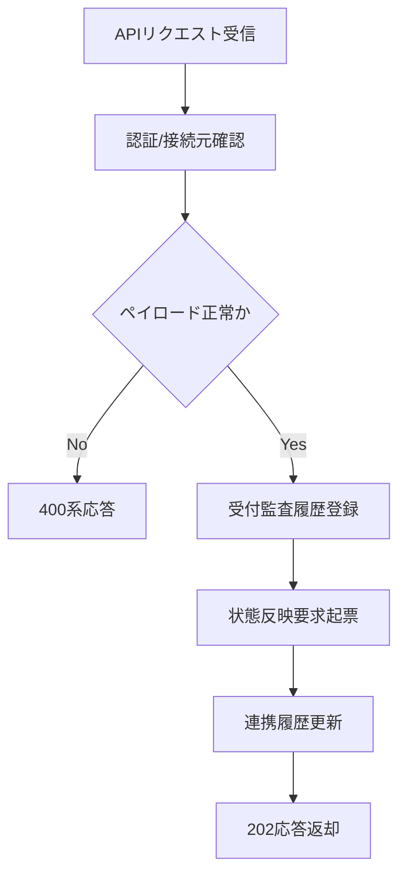

# PDS-004 配送結果受付API処理設計書

## 1. 基本情報
| 項目 | 内容 |
| --- | --- |
| 処理設計書ID | `PDS-004` |
| 関連詳細業務フローID | `DFL-001` |
| 処理名 | 配送結果受付API |
| 開始契機 | Bar社からの `POST /api/v1/delivery-results/bar` |
| 終了条件 | 受付監査を記録し、Bar社へ応答を返却し、状態反映要求を起票すること |

## 2. フロー図

## 3. 処理手順
| 手順 | 内容 |
| --- | --- |
| 1 | クライアント証明書、接続元、必須ヘッダを確認する |
| 2 | `bar_shipment_id`、`status_seq`、`delivery_status`、`event_datetime` を検証する |
| 3 | 受信電文原文と受付結果を `th_if_history` に記録する |
| 4 | 配送状態取込Worker向けの内部状態反映要求を起票する |
| 5 | Bar社へ `202 Accepted` またはエラー応答を返却する |

## 4. 応答方針
- 認証失敗は `401/403` を返却する。
- JSON形式不正、必須欠落、コード値不正は `400` を返却する。
- 業務状態反映は同期完了を待たず、受付完了時点で `202` を返却する。
