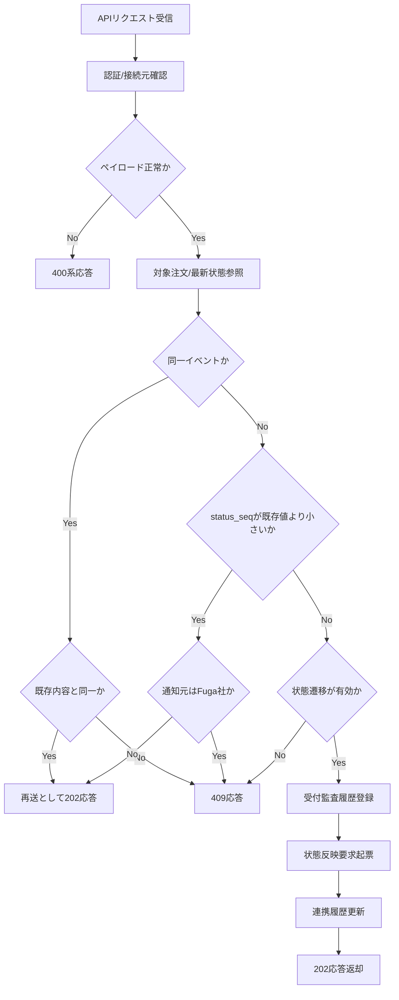

# PDS-004 配送結果受付API処理設計書

## 1. 基本情報
| 項目 | 内容 |
| --- | --- |
| 処理設計書ID | `PDS-004` |
| 関連詳細業務フローID | `DFL-001`, `DFL-002` |
| 処理名 | 配送結果受付API |
| 開始契機 | Bar社またはFuga社からの `POST /api/v1/delivery-results/{carrier}` |
| 終了条件 | 通知元配送会社へ判定結果を応答し、正常な新規イベントでは受付監査記録と状態反映要求起票を完了すること |

## 2. フロー図

## 3. 処理手順
| 手順 | 内容 |
| --- | --- |
| 1 | クライアント証明書、接続元、必須ヘッダを確認する |
| 2 | `carrier_shipment_id`、`status_seq`、`delivery_status`、`event_occurred_at` を検証する |
| 3 | 対象注文と最新配送状態を参照し、配送会社受付番号との対応、`status_seq`、状態遷移可否を確認する |
| 4 | 同一イベントの同一内容再送は新たな状態反映要求を起票せず、既存受付結果として `202 Accepted` を返却する |
| 5 | 既存値より小さい `status_seq` は状態反映要求を起票せず、Bar社には旧イベントの冪等受付として `202 Accepted`、Fuga社には契約どおり `409 Conflict` を返却する |
| 6 | 許可されない状態遷移、または同一イベントの内容相違は `409 Conflict` を返却する |
| 7 | 正常な新規イベントは、受信電文原文と受付結果を `th_interface_history` に記録する |
| 8 | 配送状態取込Worker向けの内部状態反映要求を起票する |
| 9 | 通知元配送会社へ `202 Accepted` を返却する |

## 4. 応答方針
- 認証失敗は `401/403` を返却する。
- JSON形式不正、必須欠落、コード値不正は `400` を返却する。
- 同一イベントの同一内容再送は冪等成功として `202` を返却し、状態反映要求を重複起票しない。
- 旧 `status_seq` は状態反映要求を起票せず、Bar社には `202`、Fuga社には `409` を返却する。
- 同一イベントの内容相違、許可されない状態遷移は `409` を返却する。
- 業務状態反映は同期完了を待たず、受付完了時点で `202` を返却する。
