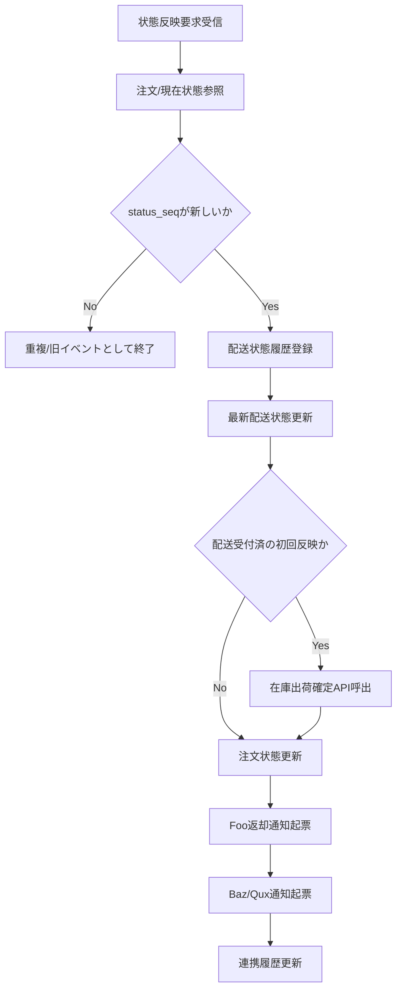

# PDS-005 配送状態取込Worker処理設計書

## 1. 基本情報
| 項目 | 内容 |
| --- | --- |
| 処理設計書ID | `PDS-005` |
| 関連詳細業務フローID | `DFL-001`, `DFL-002` |
| 処理名 | 配送状態取込Worker |
| 開始契機 | 配送結果受付APIが起票した状態反映要求1件 |
| 終了条件 | 最新状態更新、履歴登録、対外通知起票が完了すること |

## 2. フロー図

## 3. 処理手順
| 手順 | 内容 |
| --- | --- |
| 1 | 状態反映要求から `order_id`、`carrier_shipment_id`、`carrier_code`、`status_seq` を取得する |
| 2 | 注文ヘッダ、配送状態最新を参照し、既存 `status_seq` より大きいか判定する |
| 3 | 新規イベントなら配送状態履歴を登録する |
| 4 | `delivery_status`、`reason_category`、表示用状態名称を配送状態最新へ反映する |
| 5 | `delivery_status=ACCEPTED` かつ当該注文で初回受付済反映の場合、在庫出荷確定APIを呼び出す |
| 6 | 状態遷移設計に従って注文状態を更新する |
| 7 | Foo向け配送結果返却通知、Baz請求通知、Qux注文状態通知を必要に応じて起票する |
| 8 | 反映結果を連携履歴へ記録する |

## 4. 判定ルール
- `status_seq` が同値以下なら重複または逆順として最新状態は更新しない。
- `carrier_code` は `BAR` または `FUGA` を取り、配送状態履歴へ通知元配送会社として保持する。
- 初回の `ACCEPTED` 反映時のみ、引当済在庫を出荷確定へ更新する。
- `DELIVERED`、`CANCELLED` は終端状態として扱う。
- `reason_category` が存在する場合は対外表示名を正規化して保持する。
