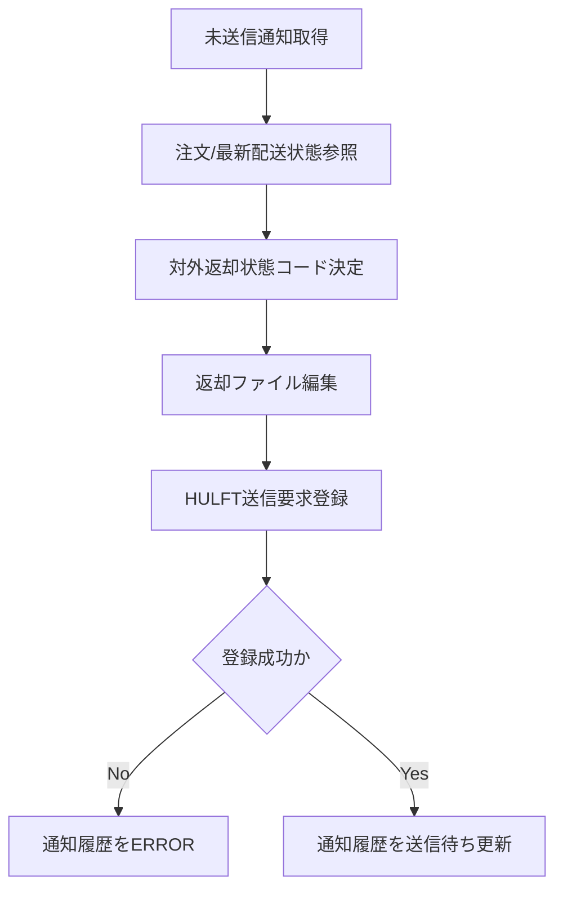

# PDS-006 配送結果返却Worker処理設計書

## 1. 基本情報
| 項目 | 内容 |
| --- | --- |
| 処理設計書ID | `PDS-006` |
| 関連詳細業務フローID | `DFL-001` |
| 処理名 | 配送結果返却Worker |
| 開始契機 | Foo向け配送結果返却通知の起票 |
| 終了条件 | 配送結果返却ファイルを編集し、HULFT送信要求を登録すること |

## 2. フロー図

## 3. 処理手順
| 手順 | 内容 |
| --- | --- |
| 1 | `PENDING` のFoo向け配送結果返却通知を取得する |
| 2 | 注文ヘッダ、配送状態最新、配送会社コードを参照する |
| 3 | 内部状態から Foo返却用の `order_status`、`status_datetime` を決定する |
| 4 | `FOO_ORDER_STATUS_yyyyMMddHHmmssSSS_NNN.dat` を編集する |
| 5 | HULFT送信要求を登録し、通知履歴へファイル名と要求結果を反映する |

## 4. 補足
- 同一状態の重複返却は行わず、通知履歴で送信済み判定する。
- 正式な返却手段はHULFTであり、状態照会APIは補助導線として扱う。
