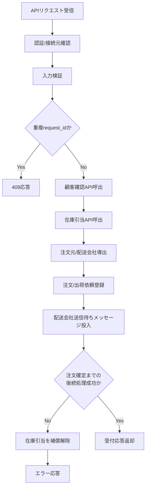

# PDS-007 Hoge直受注登録API処理設計書

## 1. 基本情報
| 項目 | 内容 |
| --- | --- |
| 処理設計書ID | `PDS-007` |
| 関連詳細業務フローID | `DFL-002` |
| 処理名 | Hoge直受注登録API |
| 開始契機 | `POST /api/v1/shipment-requests` |
| 終了条件 | 注文起票、配送会社送信待ちメッセージ投入後にAPI応答を返却すること |

## 2. フロー図

## 3. 処理手順
| 手順 | 内容 |
| --- | --- |
| 1 | 認証情報、接続元IP、必須ヘッダを確認する |
| 2 | JSON形式、配送先、荷物個数、支払方法、税抜単価、税率を含む必須項目、`shipment_mode`、`shipping_release_at` の整合を検証する |
| 3 | `partner_request_id` の重複を確認し、重複時は `409` を返却する |
| 4 | 顧客確認APIと在庫引当APIを同期呼出し、引当結果、倉庫場所、商品名、単位重量、温度帯、サイズ区分を取得する |
| 5 | `order_source=HOGE`、`partner_priority_level=0`、`shipping_priority_class=NORMAL`、配送制約に応じた配送会社コードを導出する |
| 6 | 税抜金額と消費税額を算出し、配送先、商品属性、金額のスナップショットを含む注文ヘッダ、注文明細、出荷依頼、連携履歴を登録する |
| 7 | `bar-shipment-request-queue.fifo` または `fuga-shipment-request-queue.fifo` に送信待ちメッセージを投入する |
| 8 | 在庫引当成功後、注文登録コミットまたはキュー投入までに失敗した場合は、在庫引当解除APIで当該引当を補償解除する |
| 9 | `order_id`、`registration_status`、`current_status` を含む応答を返却する |

## 4. 応答方針
- 予約出荷かつ `shipping_release_at` 未到来なら `WAITING_SHIPPING_RELEASE` を返却する。
- `shipping_release_at` 未到来時は配送会社を問わず送信せず、配送会社連携Workerで解放日時まで待機する。
- Bar向け案件で営業時間外なら内部的には送信待ちとなるが、API応答は受付完了を返す。
- 補償解除にも失敗した場合は引当IDを障害復旧対象として記録し、`500/503` を返却して運用対応へ引き継ぐ。
