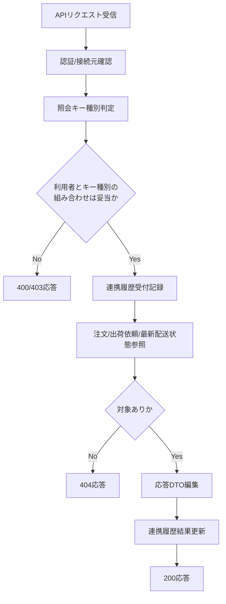

# PDS-008 出荷状態照会API処理設計書

## 1. 基本情報
| 項目 | 内容 |
| --- | --- |
| 処理設計書ID | `PDS-008` |
| 関連詳細業務フローID | `DFL-002`, `DFL-003` |
| 処理名 | 出荷状態照会API |
| 開始契機 | `GET /api/v1/shipment-status/{lookup_key}` |
| 終了条件 | 照会条件検証、状態参照、応答返却、連携履歴更新が完了すること |

## 2. フロー図

## 3. 処理手順
| 手順 | 内容 |
| --- | --- |
| 1 | 呼出元システムID、認証情報、接続元を確認する |
| 2 | `lookup_key` を `partner_order_id` または `partner_request_id` として正規化する |
| 3 | Foo社は `partner_order_id` のみ、Fuga社は両キー可、の利用制約を判定する |
| 4 | 注文ヘッダ、出荷依頼、配送状態最新を参照する |
| 5 | `current_status`、`delivery_company_code`、`latest_event` を編集する |
| 6 | 応答結果を連携履歴へ記録し、レスポンスを返却する |

## 4. 応答編集ルール
- 同一注文に複数配送イベントがある場合は最新 `status_seq` の状態を返す。
- Fuga社から `partner_request_id` 指定時は、対象注文を一意に解決できる場合のみ返却する。
- 表示用状態名称はQux向け通知と同じ正規化ルールを利用する。
