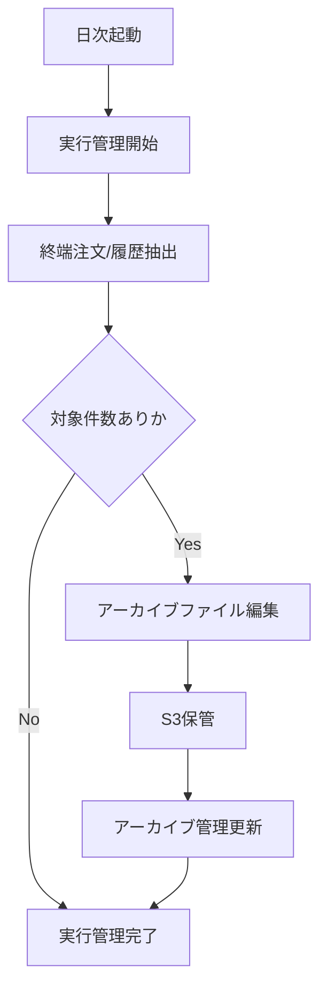

# PDS-009 日次アーカイブBatch処理設計書

## 1. 基本情報
| 項目 | 内容 |
| --- | --- |
| 処理設計書ID | `PDS-009` |
| 関連詳細業務フローID | `DFL-004` |
| 処理名 | 日次アーカイブBatch |
| 開始契機 | 日次スケジュール起動 |
| 終了条件 | 対象抽出、アーカイブファイル生成、S3保管、管理更新が完了すること |

## 2. フロー図

## 3. 処理手順
| 手順 | 内容 |
| --- | --- |
| 1 | 実行ID、実行開始日時を採番し、アーカイブ管理を開始状態で登録する |
| 2 | 終端状態注文、配送履歴、通知履歴、連携履歴を抽出する |
| 3 | 抽出結果をアーカイブレコードへ整形し、ファイルを生成する |
| 4 | アーカイブ出力S3、売上アーカイブS3へ保管する |
| 5 | 件数、ファイル名、格納先、完了日時をアーカイブ管理へ更新する |

## 4. 補足
- 正常完了後も原本データの即時削除は行わず、保持期間ルールに従って別ジョブで削除する。
- 対象0件でも実行履歴は残す。
