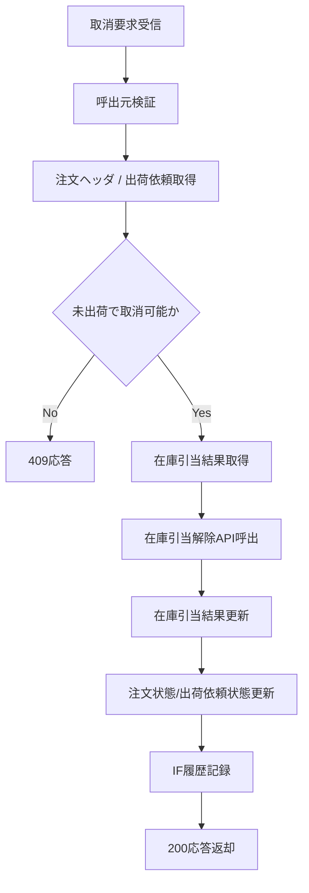

# PDS-010 未出荷取消API処理設計書

## 1. 基本情報
| 項目 | 内容 |
| --- | --- |
| 処理設計書ID | `PDS-010` |
| 関連詳細業務フローID | `DFL-005` |
| 処理名 | 未出荷取消API |
| 開始契機 | 運用担当者からの `POST /api/v1/internal/orders/{order_id}/cancel` |
| 終了条件 | 取消可否判定、在庫引当解除、注文/出荷依頼更新、応答返却が完了すること |

## 2. フロー図

## 3. 処理手順
| 手順 | 内容 |
| --- | --- |
| 1 | `X-Client-System-Id` が `HOGE-OPS-PORTAL` であることを確認する |
| 2 | `order_id` から注文ヘッダ、出荷依頼を取得する |
| 3 | 注文状態が `WAITING_SHIPPING_RELEASE`、`WAITING_BAR_REQUEST`、`WAITING_FUGA_REQUEST` のいずれかであり、出荷依頼状態が `PENDING`、`WAITING_BUSINESS_HOURS`、`FAILED` のいずれかであることを確認する |
| 4 | `t_stock_reservation_result` から対象注文の引当結果を取得する |
| 5 | 引当結果ごとに `IF-HOGE-STK-002` を呼び出し、在庫引当解除を実行する |
| 6 | 在庫引当結果を `RELEASED`、`released_quantity` 更新で保存する |
| 7 | 注文ヘッダを `CANCELLED`、出荷依頼を `CANCELLED` に更新し、送信待機を解除する |
| 8 | `IF-HOGE-OPS-001` の実行履歴を記録し、取消結果を返却する |

## 4. 応答方針
- 呼出元不正は `403` を返却する。
- 注文または出荷依頼が存在しない場合は `404` を返却する。
- Bar送信済、配送受付済、配送中、完了済などの取消不可状態は `409` を返却する。
- 在庫引当解除失敗時は `409` または `500` とし、注文状態更新は行わない。
