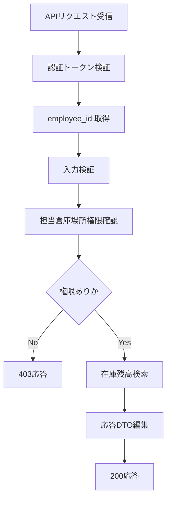

# PDS-011 倉庫在庫照会API処理設計書

## 1. 基本情報
| 項目 | 内容 |
| --- | --- |
| 処理設計書ID | `PDS-011` |
| 関連詳細業務フローID | `DFL-006` |
| 処理名 | 倉庫在庫照会API |
| 開始契機 | `GET /api/v1/stocks/inventories` |
| 終了条件 | 認証、倉庫スコープ確認、在庫参照、応答返却が完了すること |

## 2. フロー図

## 3. 処理手順
| 手順 | 内容 |
| --- | --- |
| 1 | OIDC アクセストークンを検証し、`employee_id` を取得する |
| 2 | `warehouse_location_code` 必須、`item_code` 任意の入力条件を検証する |
| 3 | `employee_id` に紐づく担当倉庫場所へ対象 `warehouse_location_code` が含まれるか確認する |
| 4 | 倉庫場所マスタ、在庫商品マスタ、在庫残高を参照し、条件に合致する在庫一覧を取得する |
| 5 | `on_hand_quantity`、`reserved_quantity`、`available_quantity`、`last_received_at` を含む応答を編集する |
| 6 | 200 応答を返却する。対象データがない場合も空配列で正常終了する |

## 4. 主な参照テーブル
| テーブル | CRUD | 用途 |
| --- | --- | --- |
| `stockkeeper.tm_warehouse_staff_scope` | `R` | 倉庫担当者の担当倉庫場所確認 |
| `stockkeeper.tm_warehouse_location` | `R` | 倉庫場所の有効性確認 |
| `stockkeeper.tm_stock_item` | `R` | 商品コード有効性確認 |
| `stockkeeper.t_stock_balance` | `R` | 在庫残高取得 |

## 5. エラー応答方針
- 担当外倉庫場所指定は `403 Forbidden` とする。
- `item_code` の形式不正または在庫商品マスタ未登録は `422 Unprocessable Entity` とする。
- 想定外例外は `500` または `503` とし、内部ログに相関IDを残す。
