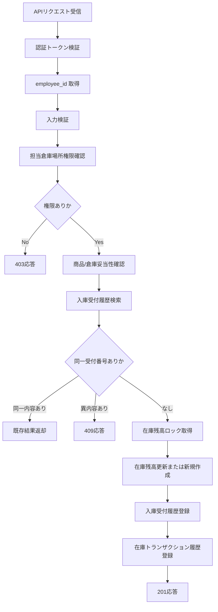

# PDS-012 入庫登録API処理設計書

## 1. 基本情報
| 項目 | 内容 |
| --- | --- |
| 処理設計書ID | `PDS-012` |
| 関連詳細業務フローID | `DFL-006` |
| 処理名 | 入庫登録API |
| 開始契機 | `POST /api/v1/stocks/receipts` |
| 終了条件 | 認証、権限確認、重複判定、在庫更新、応答返却が完了すること |

## 2. フロー図

## 3. 処理手順
| 手順 | 内容 |
| --- | --- |
| 1 | OIDC アクセストークンを検証し、`employee_id` を取得する |
| 2 | `warehouse_location_code`、`item_code`、`received_quantity`、`receipt_reference_no` の必須・形式・業務条件を検証する |
| 3 | `employee_id` に紐づく担当倉庫場所に対する登録か確認する |
| 4 | 倉庫場所マスタ、在庫商品マスタを参照し、登録対象が有効であることを確認する |
| 5 | `warehouse_location_code + receipt_reference_no` で入庫受付履歴を検索し、同一内容なら重複成功、異内容なら `409` とする |
| 6 | `item_code + warehouse_location_code` 単位で在庫残高を排他制御し、残高未作成なら新規作成する |
| 7 | 保有在庫数と利用可能在庫数を `received_quantity` 分だけ加算し、引当済在庫数は変更しない |
| 8 | 入庫受付履歴と在庫トランザクション履歴を登録し、更新後在庫を返却する |

## 4. 更新対象テーブル
| テーブル | CRUD | 用途 |
| --- | --- | --- |
| `stockkeeper.tm_warehouse_staff_scope` | `R` | 倉庫担当者の担当倉庫場所確認 |
| `stockkeeper.tm_warehouse_location` | `R` | 倉庫場所の有効性確認 |
| `stockkeeper.tm_stock_item` | `R` | 商品コード有効性確認 |
| `stockkeeper.t_stock_balance` | `R/U/C` | 在庫残高更新または新規作成 |
| `stockkeeper.th_stock_receipt_history` | `R/C` | 入庫受付番号の重複防止 |
| `stockkeeper.th_stock_transaction` | `C` | 監査履歴記録 |

## 5. 応答制御方針
- 初回登録成功時は `201 Created` を返却する。
- 同一 `receipt_reference_no` の同一内容再送は `200 OK` とし、初回登録時と同一の結果を返却する。
- 同一 `receipt_reference_no` の異内容再送は `409 Conflict` とする。
- 在庫残高未作成時は 0 在庫を作成起点とし、入庫後残高で返却する。
