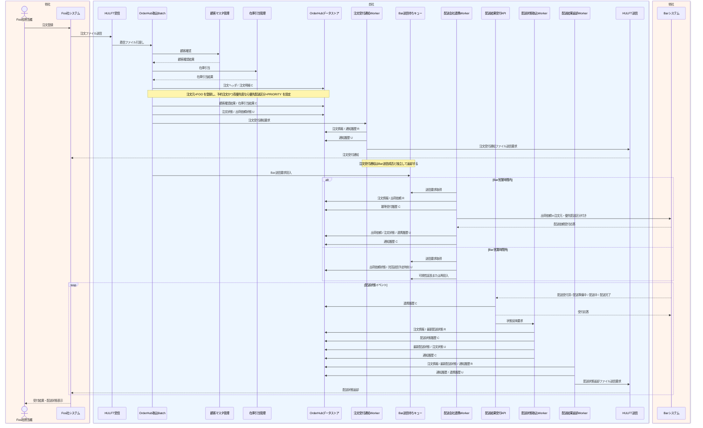

# DFL-001 Foo受注から配送結果返却詳細業務フロー

## 1. 目的
Foo社注文の受付から配送状態返却までを、Bar社営業時間制約による送信待ちを含めて、Hoge社内の主要処理単位、内部コンポーネント、データストア CRUD とあわせて整理する。

## 2. 設計書ID
| 項目 | 内容 |
| --- | --- |
| 設計書ID | `DFL-001` |
| 業務領域 | Foo受注、Bar連携、配送結果返却 |
| 逆引き対象処理設計書 | `PDS-001`, `PDS-002`, `PDS-003`, `PDS-004`, `PDS-005`, `PDS-006` |

## 3. 登場アクター・内部コンポーネント
- Foo社担当者
- Foo社システム
- HULFT受信
- OrderHub取込Batch
- 顧客マスタ管理
- 在庫引当管理
- OrderHubデータストア
- 注文受付通知Worker
- Bar送信待ちキュー
- 配送会社連携Worker
- 配送結果受付API
- Barシステム
- 配送状態取込Worker
- 配送結果返却Worker
- HULFT送信

## 4. 詳細業務フロー図

## 5. 処理単位と CRUD
| 処理単位 | 主体 | 主な DB CRUD | 補足 |
| --- | --- | --- | --- |
| 注文取込 | OrderHub取込Batch | 注文ヘッダ `C/U`、注文明細 `C`、顧客確認結果 `C`、在庫引当結果 `C`、出荷依頼 `C/U`、連携履歴 `C/U` | `order_source=FOO`、`partner_priority_level`、`shipping_priority_class` を登録 |
| 注文受付通知 | 注文受付通知Worker | 通知履歴 `R/U`、連携履歴 `C/U` | Foo社へ受付通知 |
| Bar送信待機管理 | OrderHub取込Batch / 配送会社連携Worker | 出荷依頼 `U`、連携履歴 `C/U` | `bar-shipment-request-queue.fifo` へ投入し、営業時間外は再投入する |
| 出荷依頼送信 | 配送会社連携Worker | 出荷依頼 `R/U`、冪等受付履歴 `C`、通知履歴 `C`、連携履歴 `C/U`、注文ヘッダ `U` | 平日08:00-18:00のみ送信し、優先配送区分で Bar電文を編集 |
| 配送結果受付 | 配送結果受付API | 連携履歴 `C/U` | Bar社通知を受け付け、状態反映要求を起票 |
| 配送結果反映 | 配送状態取込Worker | 配送状態履歴 `C`、配送状態最新 `R/U`、注文ヘッダ `U`、通知履歴 `C`、連携履歴 `C` | `status_seq` で順序制御し、配送準備中も保持する |
| 配送状態返却 | 配送結果返却Worker | 通知履歴 `R/U`、連携履歴 `U` | Foo社へ状態変化単位で返却 |

## 6. 関連処理設計書
- [PDS-001 Foo注文取込Batch処理設計書](../処理設計書/PDS-001_Foo注文取込Batch処理設計書.md)
- [PDS-002 注文受付通知Worker処理設計書](../処理設計書/PDS-002_注文受付通知Worker処理設計書.md)
- [PDS-003 配送会社連携Worker処理設計書](../処理設計書/PDS-003_配送会社連携Worker処理設計書.md)
- [PDS-004 配送結果受付API処理設計書](../処理設計書/PDS-004_配送結果受付API処理設計書.md)
- [PDS-005 配送状態取込Worker処理設計書](../処理設計書/PDS-005_配送状態取込Worker処理設計書.md)
- [PDS-006 配送結果返却Worker処理設計書](../処理設計書/PDS-006_配送結果返却Worker処理設計書.md)
