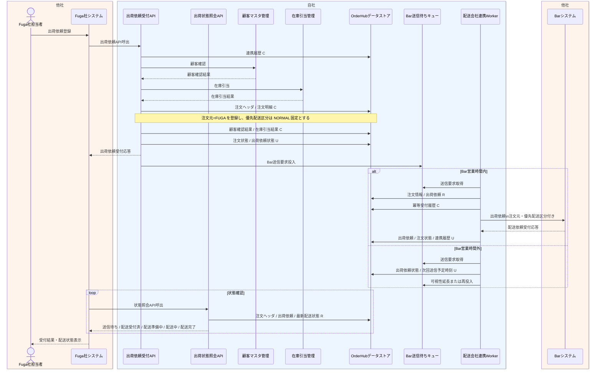

# DFL-002 Fuga出荷依頼受付詳細業務フロー

## 1. 目的
Fuga社からの出荷依頼 API 受付後、Bar社営業時間制約を考慮して送信待ちキューを経由し、状態照会で進捗を確認するまでの内部処理と CRUD を整理する。

## 2. 設計書ID
| 項目 | 内容 |
| --- | --- |
| 設計書ID | `DFL-002` |
| 業務領域 | Fuga API受付、Bar連携、状態照会 |
| 逆引き対象処理設計書 | `PDS-003`, `PDS-007`, `PDS-008` |

## 3. 登場アクター・内部コンポーネント
- Fuga社担当者
- Fuga社システム
- 出荷依頼受付API
- 出荷状態照会API
- 顧客マスタ管理
- 在庫引当管理
- OrderHubデータストア
- Bar送信待ちキュー
- 配送会社連携Worker
- Barシステム

## 4. 詳細業務フロー図

## 5. 処理単位と CRUD
| 処理単位 | 主体 | 主な DB CRUD | 補足 |
| --- | --- | --- | --- |
| API受付 | 出荷依頼受付API | 連携履歴 `C`、注文ヘッダ `C/U`、注文明細 `C`、顧客確認結果 `C`、在庫引当結果 `C`、出荷依頼 `C/U` | `order_source=FUGA`、`shipping_priority_class=NORMAL` で登録 |
| Bar送信待機管理 | 出荷依頼受付API / 配送会社連携Worker | 出荷依頼 `U`、連携履歴 `C/U` | `bar-shipment-request-queue.fifo` へ投入し、営業時間外は待機する |
| 出荷依頼送信 | 配送会社連携Worker | 出荷依頼 `R/U`、冪等受付履歴 `C`、注文ヘッダ `U`、連携履歴 `U` | 平日08:00-18:00のみ Bar社送信 |
| 状態照会 | 出荷状態照会API | 注文ヘッダ `R`、出荷依頼 `R`、配送状態最新 `R` | Fuga社はポーリングで進捗確認 |

## 6. 関連処理設計書
- [PDS-003 配送会社連携Worker処理設計書](../処理設計書/PDS-003_配送会社連携Worker処理設計書.md)
- [PDS-007 Fuga出荷依頼受付API処理設計書](../処理設計書/PDS-007_Fuga出荷依頼受付API処理設計書.md)
- [PDS-008 出荷状態照会API処理設計書](../処理設計書/PDS-008_出荷状態照会API処理設計書.md)
