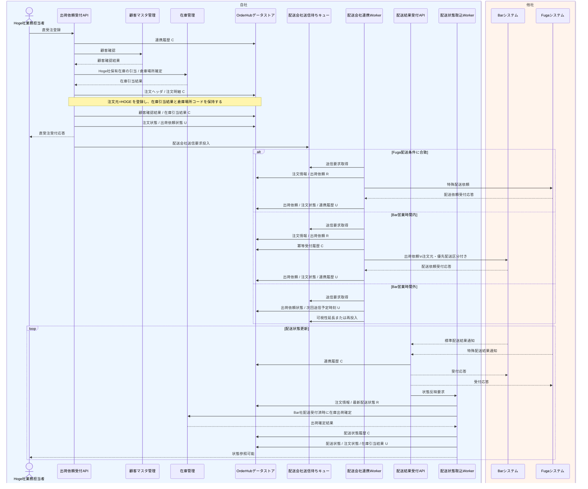

# DFL-002 Hoge直受注から配送委託詳細業務フロー

## 1. 目的
Hoge社業務部門の直受注登録後、配送条件に応じて Bar社またはFuga社へ配送委託し、配送状態を追跡するまでの内部処理と CRUD を整理する。あわせて、在庫引当が Hoge社保有在庫に対する社内処理であることを明確にする。

## 2. 設計書ID
| 項目 | 内容 |
| --- | --- |
| 設計書ID | `DFL-002` |
| 業務領域 | 直受注登録、配送会社連携、状態管理 |
| 逆引き対象処理設計書 | `PDS-003`, `PDS-004`, `PDS-005`, `PDS-007` |

## 3. 登場アクター・内部コンポーネント
- Hoge社業務担当者
- 出荷依頼受付API
- 顧客マスタ管理
- 在庫管理
- OrderHubデータストア
- 配送会社送信待ちキュー
- 配送会社連携Worker
- 配送結果受付API
- 配送状態取込Worker
- Barシステム
- Fugaシステム

## 4. 詳細業務フロー図

## 5. 処理単位と CRUD
| 処理単位 | 主体 | 主な DB CRUD | 補足 |
| --- | --- | --- | --- |
| 直受注登録 | 出荷依頼受付API | 連携履歴 `C`、注文ヘッダ `C/U`、注文明細 `C`、顧客確認結果 `C`、在庫引当結果 `C`、出荷依頼 `C/U` | `order_source=HOGE` で登録し、Hoge社保有在庫の引当結果と倉庫場所コードを保持 |
| 配送会社送信待機管理 | 出荷依頼受付API / 配送会社連携Worker | 出荷依頼 `U`、連携履歴 `C/U` | 配送会社別送信キューへ投入し、Bar向けのみ営業時間外は待機する |
| 出荷依頼送信 | 配送会社連携Worker | 出荷依頼 `R/U`、冪等受付履歴 `C`、注文ヘッダ `U`、連携履歴 `U` | 配送条件に応じて Bar社またはFuga社へ送信 |
| 配送結果受付 | 配送結果受付API | 連携履歴 `C/U` | Bar社またはFuga社の通知を受け付け、状態反映要求を起票する |
| 状態管理 | 配送状態取込Worker | 注文ヘッダ `R/U`、出荷依頼 `R/U`、配送状態最新 `R/U`、配送状態履歴 `C`、在庫引当結果 `U` | 配送会社からの結果を受けて進捗を更新し、Bar社の初回 `配送受付済` 受信時に在庫出荷確定を行う |

## 6. 関連処理設計書
- [PDS-003 配送会社連携Worker処理設計書](../処理設計書/PDS-003_配送会社連携Worker処理設計書.md)
- [PDS-004 配送結果受付API処理設計書](../処理設計書/PDS-004_配送結果受付API処理設計書.md)
- [PDS-005 配送状態取込Worker処理設計書](../処理設計書/PDS-005_配送状態取込Worker処理設計書.md)
- [PDS-007 Hoge直受注登録API処理設計書](../処理設計書/PDS-007_Hoge直受注登録API処理設計書.md)
