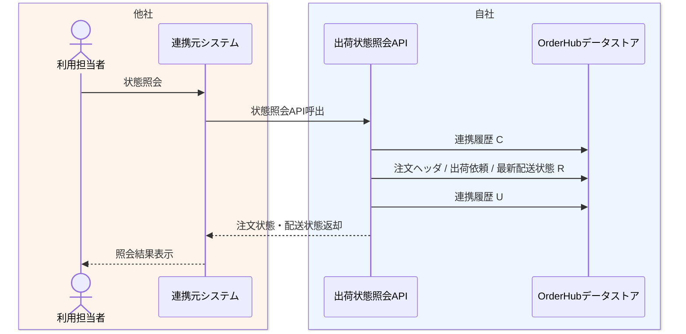

# DFL-003 出荷状態照会詳細業務フロー

## 1. 目的
状態照会 API 呼出時の認証、照会条件検証、OrderHub 参照、応答返却までの内部処理と CRUD を整理する。

## 2. 設計書ID
| 項目 | 内容 |
| --- | --- |
| 設計書ID | `DFL-003` |
| 業務領域 | 状態照会API |
| 逆引き対象処理設計書 | `PDS-008` |

## 3. 登場アクター・内部コンポーネント
- 利用担当者
- 連携元システム
- 出荷状態照会API
- OrderHubデータストア

## 4. 詳細業務フロー図

## 5. 処理単位と CRUD
| 処理単位 | 主体 | 主な DB CRUD | 補足 |
| --- | --- | --- | --- |
| API受付 | 出荷状態照会API | 連携履歴 `C/U` | 認証、照会条件検証を含む |
| 状態参照 | 出荷状態照会API | 注文ヘッダ `R`、出荷依頼 `R`、配送状態最新 `R` | 応答編集あり |

## 6. 関連処理設計書
- [PDS-008 出荷状態照会API処理設計書](../処理設計書/PDS-008_出荷状態照会API処理設計書.md)
