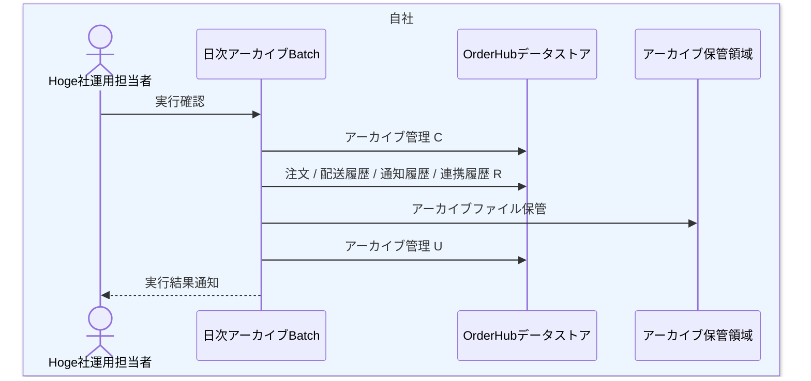

# DFL-004 日次アーカイブ詳細業務フロー

## 1. 目的
完了済みデータの抽出からアーカイブ保管完了までの内部処理と CRUD を整理する。

## 2. 設計書ID
| 項目 | 内容 |
| --- | --- |
| 設計書ID | `DFL-004` |
| 業務領域 | 日次アーカイブ |
| 逆引き対象処理設計書 | `PDS-009` |

## 3. 登場アクター・内部コンポーネント
- Hoge社運用担当者
- 日次アーカイブBatch
- OrderHubデータストア
- アーカイブ保管領域

## 4. 詳細業務フロー図

## 5. 処理単位と CRUD
| 処理単位 | 主体 | 主な DB CRUD | 補足 |
| --- | --- | --- | --- |
| 実行開始 | 日次アーカイブBatch | アーカイブ管理 `C` | 実行 ID 採番 |
| 対象抽出 | 日次アーカイブBatch | 注文ヘッダ `R`、配送状態履歴 `R`、通知履歴 `R`、連携履歴 `R` | 終端状態対象 |
| 保管完了 | 日次アーカイブBatch | アーカイブ管理 `U` | 件数、格納先更新 |

## 6. 関連処理設計書
- [PDS-009 日次アーカイブBatch処理設計書](../処理設計書/PDS-009_日次アーカイブBatch処理設計書.md)
