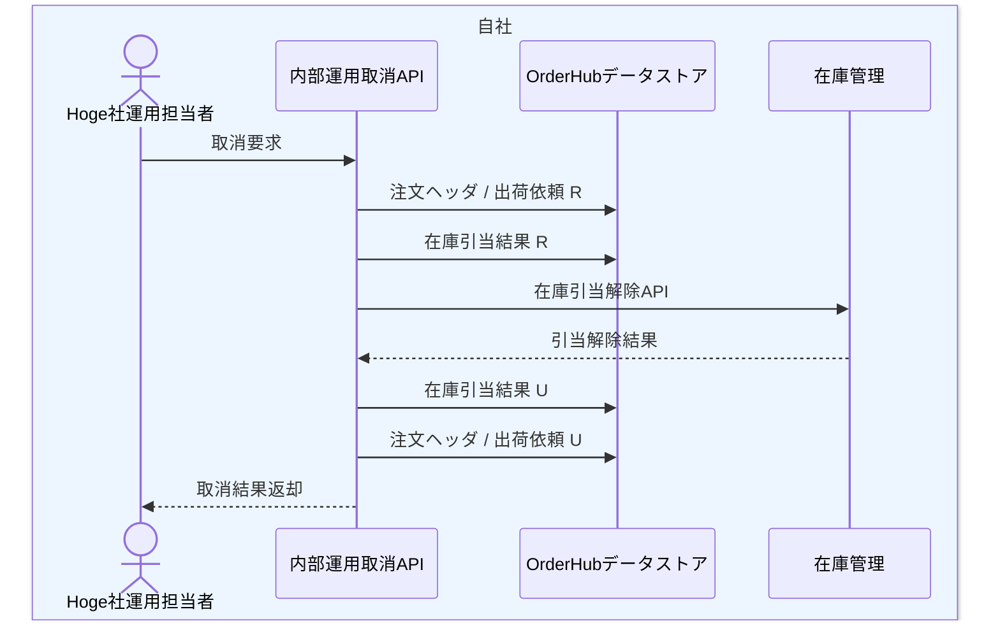

# DFL-005 未出荷取消詳細業務フロー

## 1. 目的
未出荷状態の注文を内部運用で取り消す際の処理と CRUD を整理する。

## 2. 設計書ID
| 項目 | 内容 |
| --- | --- |
| 設計書ID | `DFL-005` |
| 業務領域 | 未出荷取消 |
| 逆引き対象処理設計書 | `PDS-010` |

## 3. 登場アクター・内部コンポーネント
- Hoge社運用担当者
- 内部運用取消API
- OrderHubデータストア
- 在庫管理

## 4. 詳細業務フロー図

## 5. 処理単位と CRUD
| 処理単位 | 主体 | 主な DB CRUD | 補足 |
| --- | --- | --- | --- |
| 取消可否確認 | 内部運用取消API | 注文ヘッダ `R`、出荷依頼 `R` | 未出荷状態のみ対象 |
| 在庫解放 | 内部運用取消API | 在庫引当結果 `R` | 引当ID単位で在庫管理APIを呼び出す |
| 取消確定 | 内部運用取消API | 在庫引当結果 `U`、注文ヘッダ `U`、出荷依頼 `U` | `RELEASED`、`CANCELLED` へ更新 |

## 6. 関連処理設計書
- [PDS-010 未出荷取消API処理設計書](../処理設計書/PDS-010_未出荷取消API処理設計書.md)
