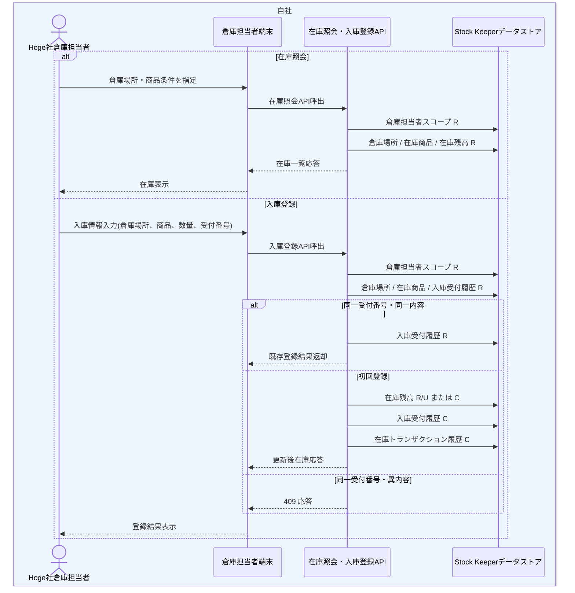

# DFL-006 倉庫在庫照会・入庫登録詳細業務フロー

## 1. 目的
Hoge社倉庫担当者による在庫照会と入庫登録について、認証、担当倉庫場所の権限制御、Stock Keeper 内部テーブルの CRUD、重複防止までを詳細化する。

## 2. 設計書ID
| 項目 | 内容 |
| --- | --- |
| 設計書ID | `DFL-006` |
| 業務領域 | 倉庫在庫運用 |
| 逆引き対象処理設計書 | `PDS-011`, `PDS-012` |

## 3. 登場アクター・内部コンポーネント
- Hoge社倉庫担当者
- 倉庫担当者端末
- 在庫照会・入庫登録API
- Stock Keeper データストア

## 4. 詳細業務フロー図

## 5. 処理単位と CRUD
| 処理単位 | 主体 | 主な DB CRUD | 補足 |
| --- | --- | --- | --- |
| 倉庫スコープ確認 | 在庫照会・入庫登録API | 倉庫担当者スコープ `R` | `employee_id` と `warehouse_location_code` の対応を確認する |
| 在庫照会 | 在庫照会・入庫登録API | 倉庫場所 `R`、在庫商品 `R`、在庫残高 `R` | `item_code` 未指定時は担当倉庫の登録済在庫を一覧返却する |
| 入庫重複判定 | 在庫照会・入庫登録API | 入庫受付履歴 `R` | `warehouse_location_code + receipt_reference_no` で照合する |
| 入庫確定 | 在庫照会・入庫登録API | 在庫商品 `R`、在庫残高 `R/U/C`、入庫受付履歴 `C`、在庫トランザクション履歴 `C` | 保有在庫数と利用可能在庫数のみ増加させる |

## 6. 詳細ルール
- 倉庫担当者は、自身に割り当てられた担当倉庫場所のみ照会・登録できる。
- 在庫照会APIは、対象在庫が存在しない場合は 200 応答で空配列を返す。
- 入庫登録APIは、在庫残高が未作成でも有効な商品コード・倉庫場所コードであれば残高を新規作成する。
- 同一 `receipt_reference_no` の同一内容再送は重複成功として扱い、最初の登録結果を返す。
- 同一 `receipt_reference_no` で商品コードまたは数量が異なる場合は `409 Conflict` とする。

## 7. 関連処理設計書
- [PDS-011 倉庫在庫照会API処理設計書](../処理設計書/PDS-011_倉庫在庫照会API処理設計書.md)
- [PDS-012 入庫登録API処理設計書](../処理設計書/PDS-012_入庫登録API処理設計書.md)
