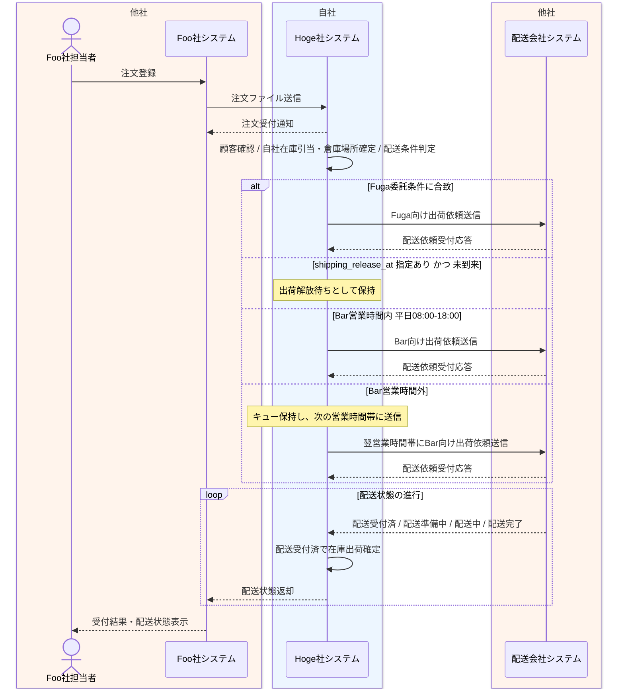

# Foo受注から配送結果返却業務フロー

## 1. 目的
Foo社からの注文受付後、Hoge社が24時間365日で依頼を受け付け、自社在庫の倉庫場所と配送条件をもとに Bar社またはFuga社へ委託しながら、段階的に配送状態を返却する一連の業務を整理する。

## 2. 登場アクター
- Foo社担当者
- Foo社システム
- Hoge社システム
- 配送会社システム

## 3. 業務フロー図

## 4. 業務の流れ
1. Foo社担当者が Foo社システムへ注文を登録する。
2. Foo社システムが注文ファイルを Hoge社システムへ送信する。
3. Hoge社システムが注文を受け付け、配送会社への送信成否とは切り離して Foo社システムへ注文受付通知を返す。
4. Hoge社システムが顧客確認、自社保有在庫の在庫引当と倉庫場所確定、配送条件判定を行い、注文元を FOO として登録したうえで、予約注文かつ高優先度の場合は優先配送区分を設定する。
5. 冷蔵便、大型商品、遠方配送などの特殊配送条件に合致する場合は、Hoge社システムが Fuga社へ特殊配送依頼を送信する。
6. 特殊配送条件に合致しない場合は Bar社向け標準配送案件として扱い、`shipping_release_at` が未来日時なら出荷解放待ちとし、そうでなければ Bar送信待ちキューへ登録する。
7. Bar社営業時間内であれば、Hoge社システムがキューから依頼を取り出して Barシステムへ出荷依頼する。
8. Bar社営業時間外であれば、Hoge社システムは依頼を保持し、次の営業時間帯に Barシステムへ送信する。
9. BarシステムまたはFugaシステムが配送依頼受付応答を返し、Hoge社システムは配送依頼受付済として状態を更新する。
10. 配送会社システムは配送準備、配送中、配送完了などの状態を時間差で通知する。
11. Hoge社システムは最初の `配送受付済` を受信した時点で引当済在庫を出荷確定へ更新する。
12. Hoge社システムは配送状態を反映し、その都度 Foo社システムへ配送状態を返却する。

## 5. 関連資料
- [../../自社内部設計/業務設計/詳細業務フロー/01_Foo受注から配送結果返却詳細業務フロー.md](../../自社内部設計/業務設計/詳細業務フロー/01_Foo受注から配送結果返却詳細業務フロー.md)
