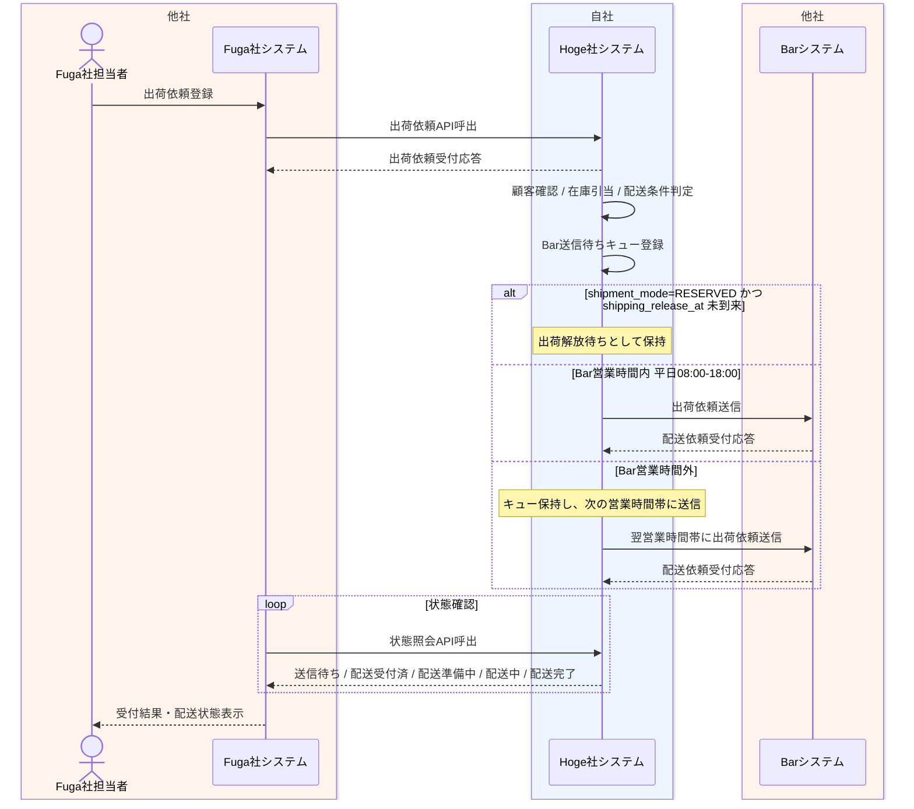

# Fuga出荷依頼受付業務フロー

## 1. 目的
Fuga社からの出荷依頼 API 受付後、Hoge社が24時間365日で依頼を受け付け、Bar社営業時間に応じて出荷依頼をキューイングしながら配送状態を管理する一連の業務を整理する。

## 2. 登場アクター
- Fuga社担当者
- Fuga社システム
- Hoge社システム
- Barシステム

## 3. 業務フロー図

## 4. 業務の流れ
1. Fuga社担当者が Fuga社システムへ出荷依頼を登録する。
2. Fuga社システムが Hoge社システムの出荷依頼受付 API を呼び出す。
3. Hoge社システムが出荷依頼を受け付け、Bar社への送信成否とは切り離して Fuga社システムへ受付結果を返す。
4. Hoge社システムが顧客確認、在庫引当、配送条件判定を行い、注文元を FUGA として登録したうえで、非優先の Bar向け出荷依頼を送信待ちキューへ登録する。
5. `shipment_mode=RESERVED` かつ `shipping_release_at` 未到来の場合は、Hoge社システムは出荷解放待ちとして保持する。
6. Bar社営業時間内であれば、Hoge社システムがキューから依頼を取り出して Barシステムへ出荷依頼する。
7. Bar社営業時間外であれば、Hoge社システムは依頼を保持し、次の営業時間帯に Barシステムへ送信する。
8. Barシステムが配送依頼受付応答を返し、Hoge社システムは配送依頼受付済として状態を更新する。
9. Fuga社システムは状態照会APIにより、送信待ち、出荷解放待ち、配送受付済、配送準備中、配送中、配送完了などの状態を参照する。

## 5. 関連資料
- [../../自社内部設計/業務設計/詳細業務フロー/02_Fuga出荷依頼受付詳細業務フロー.md](../../自社内部設計/業務設計/詳細業務フロー/02_Fuga出荷依頼受付詳細業務フロー.md)
