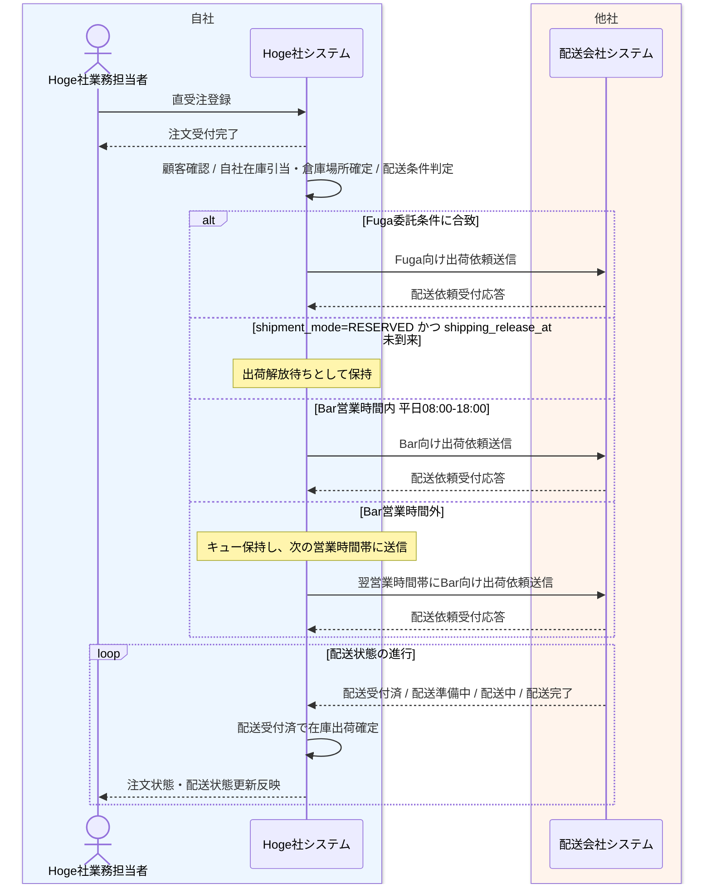

# Hoge直受注から配送委託業務フロー

## 1. 目的
Hoge社業務部門が直接受けた注文を登録した後、Hoge社が24時間365日で配送委託を制御し、Bar社またはFuga社へ出荷依頼する一連の業務を整理する。

## 2. 登場アクター
- Hoge社業務担当者
- Hoge社システム
- 配送会社システム

## 3. 業務フロー図

## 4. 業務の流れ
1. Hoge社業務担当者が Hoge社システムへ直受注を登録する。
2. Hoge社システムが出荷依頼を受け付け、配送会社への送信成否とは切り離して業務担当者へ受付完了を返す。
3. Hoge社システムが顧客確認、自社保有在庫の在庫引当と倉庫場所確定、配送条件判定を行い、注文元を HOGE として登録する。
4. 冷蔵便、大型商品、遠方配送などの特殊配送条件に合致する場合は、Hoge社システムが Fugaシステムへ出荷依頼する。
5. 特殊配送条件に合致しない場合は、Bar向け標準配送案件として扱い、`shipment_mode=RESERVED` かつ `shipping_release_at` 未到来なら出荷解放待ちとする。
6. Bar社営業時間内であれば、Hoge社システムがキューから依頼を取り出して Barシステムへ出荷依頼する。
7. Bar社営業時間外であれば、Hoge社システムは依頼を保持し、次の営業時間帯に Barシステムへ送信する。
8. BarシステムまたはFugaシステムが配送依頼受付応答を返し、Hoge社システムは配送依頼受付済として状態を更新する。
9. 配送会社システムは配送準備中、配送中、配送完了などの状態を時間差で通知する。
10. 配送受付済へ進んだ時点で、Hoge社システム内部では該当引当在庫を出荷確定へ更新する。
11. Hoge社システムは注文状態・配送状態の更新結果を業務担当者が参照できるように保持する。

## 5. 関連資料
- [../../自社内部設計/業務設計/詳細業務フロー/02_Hoge直受注から配送委託詳細業務フロー.md](../../自社内部設計/業務設計/詳細業務フロー/02_Hoge直受注から配送委託詳細業務フロー.md)
