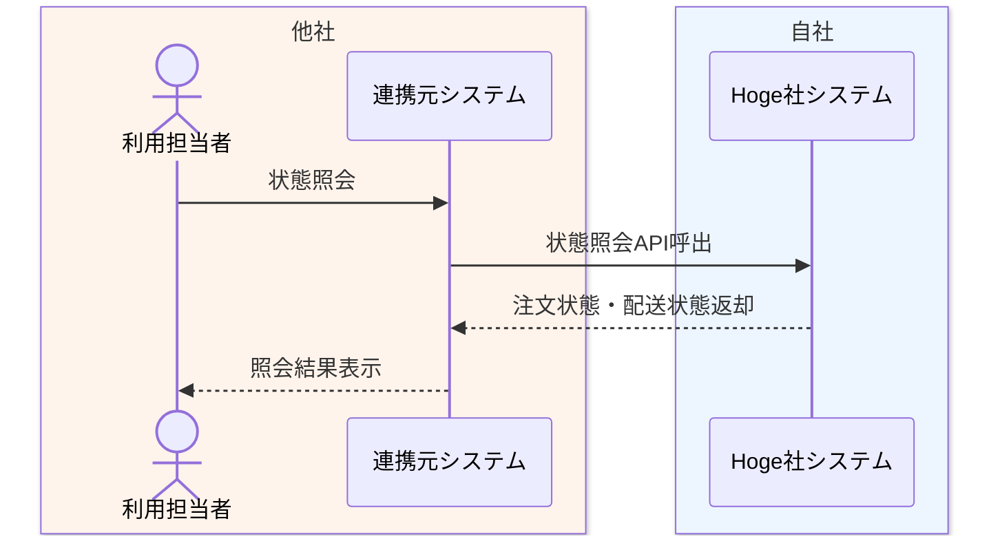

# 出荷状態照会業務フロー

## 1. 目的
Foo社からの状態照会依頼に対して、Hoge社が注文状態と配送状態を返却する業務を整理する。

## 2. 登場アクター
- 利用担当者
- 連携元システム
- Hoge社システム

## 3. 業務フロー図

## 4. 業務の流れ
1. 利用担当者が連携元システムから状態照会を実行する。
2. 連携元システムが Hoge社システムの状態照会 API を呼び出す。
3. Hoge社システムが `partner_order_id` をもとに対象注文の注文状態、配送状態を参照する。
4. Hoge社システムが照会結果を返却する。

## 5. 関連資料
- [../../自社内部設計/業務設計/詳細業務フロー/03_出荷状態照会詳細業務フロー.md](../../自社内部設計/業務設計/詳細業務フロー/03_出荷状態照会詳細業務フロー.md)
