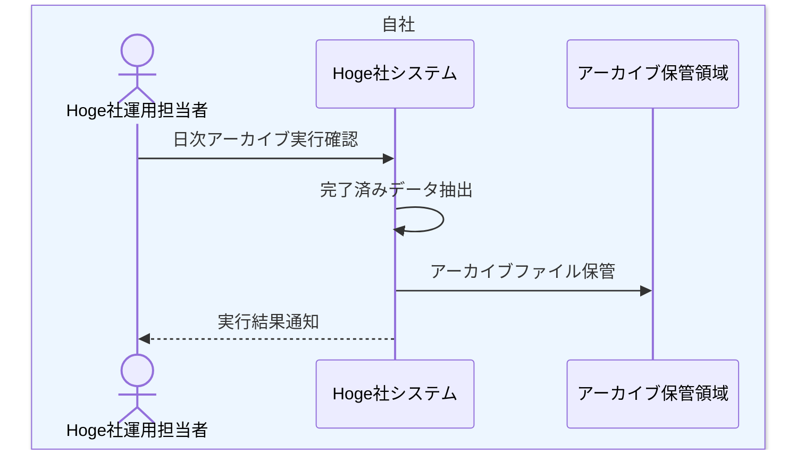

# 日次アーカイブ業務フロー

## 1. 目的
Hoge社が完了済みの注文・配送・通知データを日次でアーカイブ保管する業務を整理する。

## 2. 登場アクター
- Hoge社運用担当者
- Hoge社システム
- アーカイブ保管領域

## 3. 業務フロー図

## 4. 業務の流れ
1. 日次アーカイブBatch が起動する。
2. Hoge社システムが完了済み注文、配送履歴、通知履歴を抽出する。
3. Hoge社システムがアーカイブファイルを生成する。
4. アーカイブ保管領域へ保管する。
5. 実行結果を管理情報へ反映する。

## 5. 関連資料
- [../../自社内部設計/業務設計/詳細業務フロー/04_日次アーカイブ詳細業務フロー.md](../../自社内部設計/業務設計/詳細業務フロー/04_日次アーカイブ詳細業務フロー.md)
