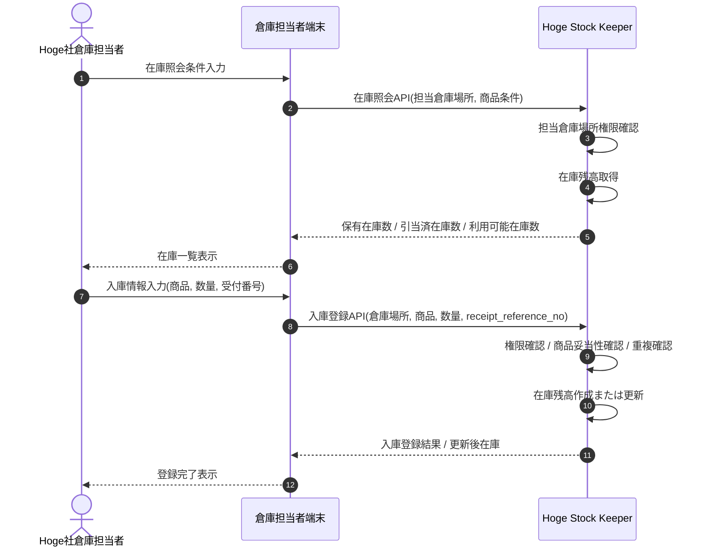

# 倉庫在庫照会・入庫登録業務フロー

## 1. 目的
Hoge社倉庫担当者が、自身の担当倉庫場所に登録されている在庫を確認し、入庫発生時に Stock Keeper へ即時反映する業務の流れを整理する。

## 2. 業務フロー図

## 3. 業務シナリオ

1. 倉庫担当者は、自身の担当倉庫場所を指定して在庫照会を行う。
2. Stock Keeper は、担当倉庫場所権限を確認したうえで、対象倉庫の在庫残高を返却する。
3. 倉庫担当者は、実際に商品が到着した時点で入庫登録を行う。
4. Stock Keeper は、商品コード、倉庫場所コード、数量、入庫受付番号を検証し、重複登録でないことを確認する。
5. 問題がなければ、保有在庫数と利用可能在庫数を更新し、更新後の在庫を返却する。

## 4. 補足

- 本業務フローは倉庫担当者による在庫照会と入庫登録を対象とする。
- 棚卸差異調整、返品戻入、倉庫間移動は本業務フローの対象外とする。
- 詳細な認可方式、監査ログ、物理テーブル更新順は後続の設計資料で定義する。
